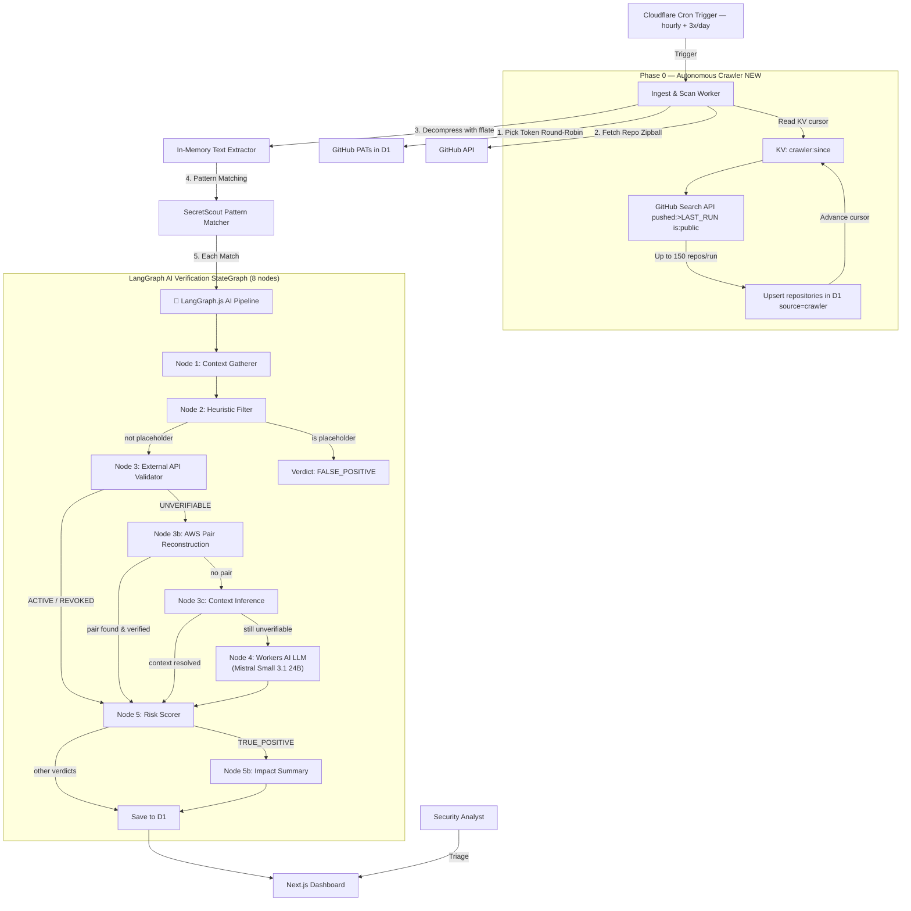

<!-- donation:eth:start -->
<div align="center">

## Support Development

If this project helps your work, support ongoing maintenance and new features.

**ETH Donation Wallet**<br>
`0x11282eE5726B3370c8B480e321b3B2aA13686582`

<a href="https://etherscan.io/address/0x11282eE5726B3370c8B480e321b3B2aA13686582">
  
</a>

_Scan the QR code or copy the wallet address above._

</div>
<!-- donation:eth:end -->

<div align="center">

# 🔍 RepoScout


> AI-verified GitHub secret scanning dashboard, running entirely on Cloudflare's free tier.


### _"Don't just find secrets — know which ones are still live."_

</div>

---

## Table of Contents

- [What is RepoScout?](#what-is-reposcout)
- [Use Cases](#use-cases)
- [Features](#features)
- [Architecture](#architecture)
- [Scan Execution Flow](#scan-execution-flow)
- [LangGraph AI Verification Pipeline](#langgraph-ai-verification-pipeline)
- [Risk Score Formula](#risk-score-formula)
- [Quick Start](#quick-start)
- [Project Structure](#project-structure)
- [API Reference](#api-reference)
- [CLI Tool for AI Assistants](#cli-tool-for-ai-assistants)
- [Configuration](#configuration)
- [Database Schema](#database-schema)
- [Security & Rate Limiting](#security--rate-limiting)
- [Security Policy](#security-policy)
- [Related Projects](#-related-projects)
- [Services Offered](#-services-offered)
- [License](#license)
- [Acknowledgments](#acknowledgments)

---

## What is RepoScout?

RepoScout is an **AI-powered GitHub secret scanning platform** that continuously monitors repositories for exposed credentials and automatically verifies their validity through an intelligent **LangGraph.js verification pipeline**.

### Autonomous Crawling — No Seed List Required

RepoScout no longer requires you to manually provide a list of repositories to scan. An autonomous crawler runs before every scan cycle and discovers recently-pushed public repositories from the GitHub Search API:

- **Continuous discovery** — every cron tick, the crawler queries `pushed:>LAST_RUN is:public` to find repos that received new commits since the previous run.
- **Change-aware** — repos already in D1 are only re-queued if their `pushed_at` timestamp advanced. Stale repos are skipped.
- **KV-backed cursor** — the last-run timestamp is stored in Cloudflare KV (`crawler:since`). On the very first run, it defaults to 24 hours ago.
- **Rate-limit safe** — the crawler consumes at most 5 GitHub Search API requests per run (150 repos) from the PAT pool, leaving the remaining quota for zipball scanning.
- **Dedup** — repos are upserted by `(owner, name)` — duplicates never accumulate.

You can still manually seed repos (for orgs you own or specific targets) via:
```bash
npm run db:seed-repos:remote
```
Manual repos are tagged `source='manual'`; crawler-discovered repos are tagged `source='crawler'`.

### The AI Advantage

Unlike traditional regex-based scanners that flood security teams with false positives, RepoScout uses a sophisticated **5-node LangGraph state machine** powered by **Cloudflare Workers AI** to intelligently classify every finding before it reaches a human:

- **Smart Context Analysis** — AI examines surrounding code to understand whether a match is a real credential or test data
- **Live Credential Testing** — Automated API validation against 30+ provider endpoints (GitHub, AWS, Stripe, Slack, Anthropic, OpenAI, and more)
- **LLM-Powered Classification** — For ambiguous cases, `@cf/mistralai/mistral-small-3.1-24b-instruct` (24B params) analyzes the full context and delivers confidence-scored verdicts
- **Adaptive Routing** — LangGraph's conditional edges route findings through validation paths based on credential type, entropy, and context

### Three-Verdict System

Instead of dumping raw regex matches into an inbox, RepoScout's AI pipeline resolves each finding to exactly one verdict:

| Verdict              | Meaning                                                                                                         |
| -------------------- | --------------------------------------------------------------------------------------------------------------- |
| `TRUE_POSITIVE`      | **AI-confirmed active credential** — tested live against the provider's API and still valid                     |
| `FALSE_POSITIVE`     | **AI-dismissed** — placeholder/test value, low-entropy, or the credential was tested and revoked                |
| `NEEDS_HUMAN_REVIEW` | **Ambiguous** — provider couldn't be tested and AWS/context-inference nodes found no paired data, and the LLM classifier's confidence was below 0.50 |

### Powered by LangGraph

The verification pipeline is built with **LangGraph.js**, enabling:

- **State-driven processing** with structured intermediate states
- **Conditional routing** that adapts based on heuristic and API validation results
- **Parallel node execution** for efficient batch processing
- **Persistent evaluation state** stored in Cloudflare D1

### Technology Stack

- **Pattern Engine**: Reuses SecretScout-compatible 91 YAML templates (regex + literal + entropy + composite modes)
- **AI Pipeline**: LangGraph.js 5-node StateGraph with Cloudflare Workers AI
- **Infrastructure**: 100% Cloudflare free tier (Workers, D1, KV, Pages)
- **UI Design**: Cyberpunk terminal-green aesthetic ported from **[ArxivExplorer](https://github.com/Teycir/ArxivExplorer)**

---

## Use Cases

### 1. Continuous Org-Wide Monitoring

Point RepoScout at every repo in your org and let the 3×/day cron worker keep watch. New commits that introduce a live key get flagged within 8 hours — no manual scans.

```bash
npx tsx scripts/seed-repos.ts   # add repos to monitor
npm run db:seed-repos:remote
```

### 2. Cutting Through Alert Fatigue

Traditional scanners flag every `AKIA...`-shaped string whether it's a real key or a fixture in `tests/`. RepoScout's pipeline live-tests the credential against 30+ provider APIs (GitHub, AWS, Stripe, Slack, Anthropic, OpenAI, Cloudflare, and more) — `REVOKED` and placeholder matches are dismissed automatically, so the dashboard only surfaces what actually matters.

### 3. Analyst Triage Queue

Findings the pipeline can't resolve with confidence land in `/review` — a dedicated queue sorted by severity with one-click **confirm leak** / **false positive** buttons. Every triage decision is written back to D1 as `analyst_verdict`.

### 4. Repository Risk Scoring

Each monitored repo gets a numeric `risk_score` — the sum of `SeverityWeight × VerdictMultiplier` across all its findings. The dashboard's repository grid is sorted by this score, so the riskiest repos always float to the top.

### 5. Incident Response — "Did We Already Find This?"

Hit `/api/repos/<id>/findings` (or `repo-cli findings <repoId>`) to pull every finding + AI verdict + masked token + reasoning for a repo in one call — useful when a credential leak is reported and you need to confirm whether RepoScout already caught it.

### 6. AI Assistant Integration

The bundled `repo-cli` gives Claude, ChatGPT, or any agent structured read access to repos, findings, the review queue, scan history, and dashboard stats — no browser required.

```bash
repo-cli repos 10
repo-cli queue
repo-cli stats
```

---

## Features

### 🤖 LangGraph AI Verification Pipeline

The heart of RepoScout — a **5-node intelligent state machine** that transforms raw pattern matches into actionable security intelligence:

- **Context-Aware Analysis** — Gathers ±5 lines of surrounding code for AI evaluation
- **Heuristic Pre-filtering** — Instantly dismisses obvious placeholders (`xxxx`, `dummy`, `your_key`) and low-entropy patterns
- **30+ Provider Live Testing** — Real-time API validation against GitHub, GitLab, AWS, Stripe, Slack, Anthropic, OpenAI, HuggingFace, SendGrid, Twilio, Shopify, DigitalOcean, Mailchimp, Square, Datadog, NewRelic, npm, PyPI, DockerHub, Cloudflare, Heroku, Netlify, Vercel, Linear, Notion, Discord, Telegram, Dropbox, Twitch, Zoom, Asana, Mailgun, Sentry, Airtable, PayPal
- **RSA Proof-of-Possession** — Private keys validated via `crypto.subtle` sign+verify (no network call needed)
- **LLM Classification** — `@cf/mistralai/mistral-small-3.1-24b-instruct` (24B params) analyzes unverifiable findings with confidence scoring
- **AWS Pair Reconstruction** — reconstructs AWS key pairs from surrounding context and validates live via STS `GetCallerIdentity`, converting permanently-unverifiable findings into real verdicts without burning LLM quota
- **Context Inference** — for providers that need extra parameters (Shopify shop domain, Algolia app ID, Firebase project, Okta domain, Braintree env), the LLM extracts the missing value from surrounding code and retries the API validator
- **Impact & Blast-Radius Summary** — every confirmed `TRUE_POSITIVE` gets an AI-generated plain-English summary: what access the credential grants, what data is reachable, and the single most important remediation step
- **Conditional Routing** — Findings route through different validation paths based on credential type and initial analysis
- **Daily Quota Management** — KV-backed limiter caps LLM calls at 450/day (~21 neurons/call × 450 = ~9 450 neurons, within the 10 000 free tier ceiling); ~150 calls per run across 3 daily runs

### Scanning Engine

- **SecretScout Pattern Reuse** — 91 YAML templates compiled to JSON (`scripts/compile-patterns.ts`), covering cloud creds, VCS tokens, API keys, databases, private keys, and generic high-entropy secrets
- **Zipball Streaming** — `fflate.Unzip` decompresses repo archives in-memory, never buffering the full archive (stays within the 128 MB Worker memory limit)
- **Git Trees API Fallback** — repos > 50 MB automatically switch to recursive tree + batched blob fetches
- **Line Safety** — lines > 1,000 chars skipped to prevent catastrophic regex backtracking
- **4 Pattern Kinds** — `regex`, `literal`, `entropy` (Shannon, charset-aware thresholds), and `composite` (`requireAll` + `proximityBytes`)
- **Smart Suppression** — `secretscout:ignore`, `gitleaks:allow`, `nosec` inline markers; SSH/PEM public-key false-positive guard

### Dashboard

- **Repository Risk Grid** — cards sorted by `risk_score` desc, colour-coded by severity, `DecryptedText` reveal animation
- **Findings Inspector** (`/repo/[id]`) — code snippet with the hit line highlighted, masked token, AI reasoning, analyst override, GitHub blob link
- **Analyst Queue** (`/review`) — all `NEEDS_HUMAN_REVIEW` findings sorted by severity, mini code snippet, confidence bar, one-click triage
- **Hero Strip** — live counters for repos monitored, critical findings, analyst queue size, and a live HH:MM:SS countdown to the next hourly scan
- **Terminal-Green Aesthetic** — `JetBrains Mono`, particle background, ambient beam lines, scroll-progress scan-line — ported from ArxivExplorer

### Token Pool

- **10-PAT Rotation** — round-robin by `rate_limit_remaining`, rate-limit headers synced back to D1 after every GitHub API call
- **Theoretical 50K req/hour** — 10 × 5,000/hour free-tier GitHub PATs

### Security

- **No Raw Secrets to UI/Logs** — `rawMatchedText` never leaves the scan worker; only `maskSecret()` output (`ghp_xxxx...1234`) is persisted/displayed
- **No-Auth Rate Limiting** — KV-backed fixed-window limiter on every endpoint (write: 1/5min trigger, 30/min review; read: 60/min) — see [Security & Rate Limiting](#security--rate-limiting)

### Developer Tools

- **CLI Interface** — `repo-cli` for AI assistants (repos, findings, review queue, scan runs, stats)
- **Manual Trigger** — `POST /api/trigger` for on-demand scans during development

---

## Architecture

Built entirely on Cloudflare's edge platform with **AI-first design**:

- **Autonomous Crawler**: GitHub Search API crawler — no seed list required; discovers repos with `pushed:>LAST_RUN is:public`, stores cursor in KV, upserts D1 on every cron tick
- **AI Verification Core**: LangGraph.js `StateGraph` with 8 specialized nodes + Cloudflare Workers AI (`@cf/mistralai/mistral-small-3.1-24b-instruct`)
- **Frontend**: Next.js 16 App Router, deployed as a Cloudflare Worker (via OpenNext `main` + `assets`)
- **Scan Worker**: Separate Cloudflare Worker (`reposcout-scan-worker`), 3×/day full scan + hourly crawler tick
- **Database**: Cloudflare D1 (SQLite) — 6 tables: `repositories`, `scan_runs`, `findings`, `ai_evaluations`, `scan_tokens`, `crawler_runs`
- **Cache**: Cloudflare KV — LLM quota tracking, rate limiting, crawler cursor (`crawler:since`)
- **Pattern Engine**: SecretScout's 91 YAML templates compiled to optimized JSON

### System Design with Autonomous Crawler + LangGraph AI Pipeline



---

## Scan Execution Flow

1. **Trigger** — cron fires 3×/day at 00:00, 08:00, 16:00 UTC plus an hourly lightweight pass; manual trigger via `POST /api/trigger`
2. **🆕 Autonomous Discovery** — crawler reads the `crawler:since` KV cursor, queries GitHub Search (`pushed:>CURSOR is:public`), and upserts up to 150 repos into D1 per run. Existing repos are re-queued only if their `pushed_at` advanced. Cursor advances to now.
3. **Token Selection** — picks the PAT with the most remaining quota via `pickNextToken()`, falling back to sequential env order if D1 is unavailable
4. **Repo Download** — fetches the repository zipball (`GET /repos/{owner}/{repo}/zipball/HEAD`); falls back to the Git Trees API for repos > 50 MB
5. **In-Memory Decompression** — streams the zipball through `fflate.Unzip`; binary extensions and dependency dirs (`node_modules`, `.git`, `dist`, …) are skipped immediately
6. **Pattern Matching** — each text file is scanned against all SecretScout patterns (regex / literal / entropy / composite)
6. **LangGraph Pipeline** — every match enters the 8-node validation graph, exiting with exactly one verdict; TRUE_POSITIVEs receive an additional impact summary
7. **Persistence** — findings + AI evaluations written to D1; repository `risk_score` recalculated
8. **Dashboard** — the Next.js app reads from D1 and surfaces confirmed risks + the analyst queue in real time

---

## LangGraph AI Verification Pipeline

```typescript
export function createScanValidationGraph(env: PipelineEnv) {
  return new StateGraph(ScanFindingState)
    .addNode("gatherContext",      gatherContextNode)
    .addNode("heuristicFilter",    heuristicFilterNode)
    .addNode("apiValidation",      apiValidationNode)
    .addNode("awsPairReconstruct", awsPairReconstructionNode)
    .addNode("contextInference",   contextInferenceNode)
    .addNode("llmClassification",  llmClassificationNode)
    .addNode("riskScorer",         riskScorerNode)
    .addNode("impactSummary",      impactSummaryNode)
    // ... conditional edges route through enrichment nodes before LLM
    .compile();
}
```

| Node | Purpose | Possible Outcomes |
| ---- | ------- | ----------------- |
| 1. Context Gatherer | Normalises 5-line surrounding context | — |
| 2. Heuristic Filter | Placeholder terms + low-entropy repeating hex | Short-circuits to `FALSE_POSITIVE` |
| 3. External API Validator | Live-tests the credential against its provider (30+ supported) | `ACTIVE` → `TRUE_POSITIVE` · `REVOKED` → `FALSE_POSITIVE` · `UNVERIFIABLE` → Node 3b |
| 3b. AWS Pair Reconstruction | Scans context for paired secret key, runs STS `GetCallerIdentity` | `ACTIVE`/`REVOKED` without LLM quota · no pair → Node 3c |
| 3c. Context Inference | LLM extracts missing provider param (shop domain, app ID, project…) then retries API | Resolved → skip LLM · still unverifiable → Node 4 |
| 4. Workers AI LLM Classifier | `@cf/mistralai/mistral-small-3.1-24b-instruct` (24B params, ~21 neurons/call), only for still-unverifiable findings | confidence < 0.50 → `NEEDS_HUMAN_REVIEW` |
| 5. Risk Scorer | `SeverityWeight × VerdictMultiplier` | writes `riskScore` to D1 |
| 5b. Impact Summary | AI-generated access/blast-radius/remediation note, only for `TRUE_POSITIVE` | appends `[Impact]` block to `aiReasoning` |

---

## Risk Score Formula

$$\text{RiskScore}(R) = \sum_{f \in \text{Findings}(R)} \text{SeverityWeight}(f.\text{severity}) \times \text{VerdictMultiplier}(f.\text{verdict})$$

| Severity | Weight |
| -------- | ------ |
| critical | 100    |
| high     | 40     |
| medium   | 15     |
| low      | 5      |
| info     | 1      |

| Verdict              | Multiplier |
| -------------------- | ---------- |
| `TRUE_POSITIVE`      | 2.0        |
| `NEEDS_HUMAN_REVIEW` | 1.0        |
| `FALSE_POSITIVE`     | 0.0        |

---

## Quick Start

### Prerequisites

- Node.js 18+
- Cloudflare account (free tier works)
- Wrangler CLI: `npm install -g wrangler`
- 1–10 GitHub Personal Access Tokens (classic, `public_repo` scope)

### Installation

```bash
git clone https://github.com/Teycir/RepoScout.git
cd RepoScout
npm install
wrangler login

# Create infrastructure
wrangler d1 create reposcout
wrangler kv:namespace create CACHE

# Update wrangler.local.toml and wrangler.local.jsonc with your real IDs
# (these files are gitignored — never commit them)
# wrangler.scan.toml and wrangler.jsonc contain only placeholder values

# Apply database schema
npm run db:migrate:remote

# Compile SecretScout patterns (uses built-in 27-template stub if
# ../secretscout/templates/ doesn't exist)
npm run compile-patterns

# Copy and fill env files
cp .env.example .env
# Edit .env — add GITHUB_TOKEN_1..10
```

### Development

```bash
npm run dev   # Next.js dev server → http://localhost:3000
```

### Seed Tokens & Repos

```bash
npm run db:seed-tokens:remote   # hashes + masks GITHUB_TOKEN_1..10 from .env into D1
npm run db:seed-repos:remote    # edit scripts/seed-repos.ts REPOS[] first
```

### Deployment

```bash
# Deploy scan worker first (web app's service binding needs it)
npm run deploy:scan   # uses wrangler.local.toml — never commit this file

# Deploy web app
npm run deploy        # uses wrangler.local.jsonc — never commit this file

# Smoke-test
curl -X POST https://reposcout-web.<account>.workers.dev/api/trigger
```

---

## Project Structure

```
├── app/                        # Next.js 16 app directory
│   ├── page.tsx                # Dashboard — HeroStrip + RepositoryRiskGrid
│   ├── repo/[id]/page.tsx      # FindingsInspector
│   ├── review/                 # AnalystQueue
│   │   ├── page.tsx
│   │   └── TriageButtons.tsx
│   ├── api/
│   │   ├── trigger/route.ts    # POST — manual scan trigger
│   │   ├── review/route.ts     # POST — analyst triage
│   │   ├── repos/route.ts      # GET  — repository risk grid
│   │   ├── repos/[id]/findings/route.ts  # GET — findings for a repo
│   │   ├── review-queue/route.ts  # GET — NEEDS_HUMAN_REVIEW queue
│   │   ├── scan-runs/route.ts     # GET — recent scan run history
│   │   └── stats/route.ts         # GET — dashboard summary
│   └── components/
│       ├── ParticleBackground.tsx
│       ├── BackgroundBeams.tsx
│       ├── DecryptedText.tsx
│       ├── RepositoryRiskGrid.tsx
│       ├── HeroStrip.tsx
│       ├── Navbar.tsx
│       └── ScrollProgress.tsx
├── src/
│   ├── lib/                    # Shared scanning engine (port of secretscout-core)
│   │   ├── scanner.ts          # regex / literal / entropy / composite modes
│   │   ├── validator.ts        # 30+ provider live validators
│   │   ├── entropy.ts          # Shannon entropy, charset thresholds
│   │   ├── masking.ts          # ghp_xxxx...1234 masking
│   │   ├── types.ts            # Template, Match, Verdict, Env, risk helpers
│   │   └── env.ts               # GITHUB_TOKEN_* / .env loader
│   └── scan-worker/             # Cloudflare Worker — cron + manual trigger
│       ├── index.ts             # fetch + scheduled handlers, token rotation
│       ├── scanner.ts           # zipball streaming + Git Trees fallback
│       ├── pipeline.ts          # LangGraph 5-node StateGraph
│       └── patterns.json        # compiled SecretScout templates
├── cli/                          # repo-cli — AI assistant CLI
│   ├── repo-cli.ts
│   ├── package.json
│   └── README.md
├── lib/
│   ├── db.ts                    # D1 query helpers
│   └── rateLimit.ts              # KV fixed-window rate limiter
├── migrations/schema.sql         # canonical D1 schema
├── scripts/
│   ├── compile-patterns.ts       # YAML → JSON pattern compiler
│   ├── seed-tokens.ts            # hash + mask GITHUB_TOKEN_* into D1
│   └── seed-repos.ts             # seed monitored repos
├── wrangler.jsonc                 # web app config
├── wrangler.scan.toml              # scan worker config (hourly cron)
└── SECURITY.md                     # security measures, rate limits, CORS policy, reporting
```

---

## API Reference

```
GET  /api/repos?limit=50                  # Repository risk grid (sorted by risk_score desc)
GET  /api/repos/:id/findings?limit=100    # Findings + AI evaluations for a repo
GET  /api/review-queue?limit=100          # NEEDS_HUMAN_REVIEW findings awaiting triage
GET  /api/scan-runs?limit=10              # Recent scan run history
GET  /api/stats                           # Dashboard summary counters
GET  /api/crawler?limit=10               # Crawler run history + current KV cursor

POST /api/trigger                         # Manual scan trigger — { repoId?, dryRun? }
POST /api/review                          # Analyst triage — { evalId, verdict }
```

All matched secrets are returned **pre-masked** (e.g. `ghp_xxxx...1234`) — `rawMatchedText` is never exposed via the API or persisted outside the scan worker's in-memory state.

---

## CLI Tool for AI Assistants

`repo-cli` gives Claude, ChatGPT, or any agent structured access to RepoScout findings, runs, and stats, with support for live API queries or local SQLite scans using Ollama.

### Installation

```bash
cd cli
npm run build
npm link
```

### Usage

The CLI supports both **API Mode** (default) and **Local Mode** (direct SQLite queries).

#### Remote & Local Queries
```bash
repo-cli repos 20 [--local] [--db <path>]                  # List monitored repos
repo-cli findings <repoId> 50 [--local] [--db <path>]      # Findings + AI verdicts for a repo
repo-cli queue [--local] [--db <path>]                      # Analyst review queue
repo-cli runs 5 [--local] [--db <path>]                     # Recent scan run history
repo-cli stats [--local] [--db <path>]                      # Dashboard summary counters
```

#### Local Scan & Workflow Commands
Run the discovery crawler and secret scanner locally with CPU/GPU intelligence powered by Ollama.
```bash
# Scan a repo locally (default: last 5 commits)
repo-cli scan owner/repo [depth] [--db <path>] [--max-findings <n>]

# Run crawler + scan + pipeline workflow locally
repo-cli workflow [lookbackHours] [--db <path>] [--max-repos <n>] [--max-findings <n>]
```

### Setup Requirements (Local Scanning)
1. **Ollama**: Running at `http://localhost:11434` with `gemma4:latest` model loaded.
2. **GitHub Tokens**: Define `GITHUB_TOKEN_1` to `GITHUB_TOKEN_10` in your `.env` for round-robin rotation.

See [`cli/README.md`](cli/README.md) for complete documentation.

---

## Configuration

### Environment Variables (`.env`)

```bash
# GitHub PAT rotation pool (1-10, classic, public_repo scope)
GITHUB_TOKEN_1=ghp_your_token_here
GITHUB_TOKEN_2=ghp_another_token
# ... up to GITHUB_TOKEN_10

# Optional — not yet wired to the scanner
GRAYHATWARFARE_1=...   # up to 18
URLSCAN_1=...          # up to 12
PROTONVPN_USERNAME=
PROTONVPN_PASSWORD=
```

### `wrangler.scan.toml` Secrets

Raw PATs are injected as wrangler secrets (D1 stores only SHA-256 hashes + masked display):

```bash
wrangler secret put GITHUB_TOKEN_1 --config wrangler.scan.toml
# ... repeat for GITHUB_TOKEN_2..10
```

### Cloudflare Resources

| Resource        | Binding       | Notes                                                                               |
| --------------- | ------------- | ----------------------------------------------------------------------------------- |
| D1 Database     | `DB`          | 6 tables — `repositories`, `scan_runs`, `findings`, `ai_evaluations`, `scan_tokens`, `crawler_runs` |
| KV Namespace    | `CACHE`       | LLM quota (`llm_quota:{date}`) + rate limiting (`ratelimit:*`) + crawler cursor (`crawler:since`)   |
| Workers AI      | `AI`          | `@cf/mistralai/mistral-small-3.1-24b-instruct` for nodes 3c, 4, and 5b classification        |
| Service Binding | `SCAN_WORKER` | `reposcout-scan-worker` — used by `/api/trigger`                                    |

---

## Database Schema

### `repositories`

Monitored repos — `risk_score`, `high_severity_findings`, `critical_severity_findings`, `last_scan_at`, `last_scan_status`, `source` (`manual` | `crawler`), `pushed_at` (GitHub's last push timestamp for change-detection), `crawled_at`

### `scan_runs`

Execution log — `total_repos_scanned`, `total_findings`, `true_positives`, `needs_human_review`, `false_positives`, `status`

### `crawler_runs`

Autonomous discovery log — `repos_discovered`, `repos_updated`, `since_cursor`, `next_cursor`, `status`. One row per crawler pass.

### `findings`

Individual matches — `file_path`, `line_number`, `matched_text` (masked), `context` (JSON array of ±5 lines), `pattern_id`, `template_id`, `severity`

### `ai_evaluations`

LangGraph output — `verdict`, `confidence`, `validation_method` (`api_test`/`llm`/`heuristic`), `validation_status`, `reasoning` (includes `[Impact]` blast-radius block for `TRUE_POSITIVE` findings), `analyst_reviewed`, `analyst_verdict`

### `scan_tokens`

GitHub PAT pool — `token_hash` (SHA-256), `masked_token`, `rate_limit_remaining`, `rate_limit_reset`

The canonical source of truth is [`migrations/schema.sql`](migrations/schema.sql).

---

## Security & Rate Limiting

RepoScout's API has **no authentication** by design — all endpoints are protected by a layered abuse-prevention stack instead. The full reference, including the per-endpoint table, CORS policy, fail-closed behavior, and vulnerability reporting process, lives in **[SECURITY.md](SECURITY.md)**. Summary:

| Endpoint                                                                                         | Per-IP Limit     | Global Limit  |
| ------------------------------------------------------------------------------------------------ | ---------------- | ------------- |
| `POST /api/trigger`                                                                              | 1 / 5 min        | 5 / 5 min     |
| `POST /api/review`                                                                               | 30 / min         | 200 / min     |
| `GET /api/repos`, `/api/repos/:id/findings`, `/api/review-queue`, `/api/scan-runs`, `/api/stats` | 60 / min         | —             |

- **Rate limiting** — KV-backed fixed-window limiter (`lib/rateLimit.ts`) keyed on `cf-connecting-ip` (Cloudflare-set, unspoofable). Rate-limited requests receive `429` with `Retry-After` and `RateLimit-*` headers.
- **CORS** — write endpoints (`/api/review`, `/api/trigger`) reject cross-origin browser requests from origins outside `ALLOWED_ORIGINS` (`lib/validate.ts`) with `403`; read endpoints attach `Access-Control-Allow-Origin` only for allow-listed origins. All routes implement `OPTIONS` preflight.
- **Input validation** — Content-Type/size checks, JSON-shape checks (anti prototype-pollution), UUID/enum validation on `/api/review`, type checks on `/api/trigger`'s body.
- **Fail-closed** — if the `CACHE` (KV) binding is missing in production, every rate-limited route returns `503` rather than serving unrate-limited. Local dev without `wrangler` is the only exception.
- **Secret hygiene** — `rawMatchedText` (the unmasked secret) only ever exists in the scan worker's in-memory pipeline state — it is never written to D1, never logged, and never returned by any API route. Only `maskSecret()` output (`ghp_xxxx...1234`) is persisted and displayed.

---

## Security Policy

For the complete security model — threat model, the full endpoint-by-endpoint control matrix, HTTP security headers, secret-handling guarantees, and how to report a vulnerability — see **[SECURITY.md](SECURITY.md)**.

---

<!-- related-projects:start -->

## 🌐 Related Projects

Explore more privacy-first and security tools:

### This Project's Origin


### Security Tools

- **[BurpAPISecuritySuite](https://github.com/Teycir/BurpAPISecuritySuite)** - Burp Suite extension for API security testing. 15 attack types, 108+ payloads, BOLA/IDOR detection.
- **[Mcpwn](https://github.com/Teycir/Mcpwn)** - Automated security scanner for Model Context Protocol servers. Detects RCE, path traversal, prompt injection.
- **[DiffCatcher](https://github.com/Teycir/DiffCatcher)** - Git repo discovery, diff capture, code element extraction.
- **[HoneypotScan](https://github.com/Teycir/HoneypotScan)** - Honeypot detection service for security research.
- **[CheckAPI](https://github.com/Teycir/CheckAPI)** - LLM API key validator for multiple providers. Privacy-first, client-side validation.
- **[SeekYou](https://github.com/Teycir/SeekYou)** - Host intelligence aggregator — unified OSINT across 15 sources for IPs, domains, and ASNs.

### Privacy & Encryption

- **[Timeseal](https://github.com/Teycir/Timeseal)** - Time-locked encryption vault with Dead Man's Switch. AES-256 split-key crypto, ephemeral seals.
- **[Sanctum](https://github.com/Teycir/Sanctum)** - Zero-trust encrypted vault with cryptographic plausible deniability. XChaCha20-Poly1305, Argon2id.
- **[GhostChat](https://github.com/Teycir/GhostChat)** - True P2P encrypted chat via WebRTC. No servers, no storage, self-destructing messages.

### Research & AI

- **[ArxivExplorer](https://github.com/Teycir/ArxivExplorer)** - Semantic arXiv paper search with AI-powered summaries. Source of RepoScout's dashboard components and terminal-green aesthetic.

### MCP Security Servers

- **[burp-mcp-server](https://github.com/Teycir/burp-mcp-server)** - MCP server for Burp Suite Professional. Vulnerability scanning via AI assistants.
- **[nuclei-mcp](https://github.com/Teycir/nuclei-mcp)** - MCP server for Nuclei. Multi-target scanning, severity filtering.
- **[nmap-mcp](https://github.com/Teycir/nmap-mcp)** - MCP server for Nmap. Stealth recon, vuln/NSE scanning.
<!-- related-projects:end -->

---

<!-- services:start -->

## 💼 Services Offered

- 🔒 **Security Tool Development** - Secret scanners, Burp extensions, penetration testing automation
- 🚀 **Web Application Development** - Full-stack development with Next.js, React, TypeScript
- 🔧 **Edge Computing Solutions** - Cloudflare Workers, Pages, D1, KV, Durable Objects
- 🤖 **AI Integration** - LangGraph pipelines, LLM-powered classification, intelligent automation
- 🔍 **OSINT & Threat Intelligence** - Custom reconnaissance tools, threat feed aggregation, IOC correlation
- 📊 **DevSecOps Tooling** - CI/CD secret scanning, SARIF reporting, compliance automation

**Get in Touch**: [teycirbensoltane.tn](https://teycirbensoltane.tn) | Available for freelance projects and consulting

<!-- services:end -->

---

## License

This project is licensed under the **MIT License**.

See `LICENSE` for full terms. Free for personal, academic, and commercial use.

---

## Acknowledgments

- SecretScout pattern templates, masking utility, entropy module, and provider validator logic ported to TypeScript
- [ArxivExplorer](https://github.com/Teycir/ArxivExplorer) for `ParticleBackground`, `BackgroundBeams`, `DecryptedText`, the terminal-green Tailwind tokens, and the `*-cli` AI-assistant CLI pattern
- [Cloudflare](https://cloudflare.com) for D1, KV, Workers AI, and the edge platform this entire project runs on
- [LangChain](https://github.com/langchain-ai/langgraphjs) for LangGraph.js, powering the 5-node verification pipeline
- [fflate](https://github.com/101arrowz/fflate) for in-memory streaming zipball decompression

---

<!-- attribution:start -->
<div align="center">

**Built with 💚 by [Teycir Ben Soltane](https://teycirbensoltane.tn)**

</div>
<!-- attribution:end -->
