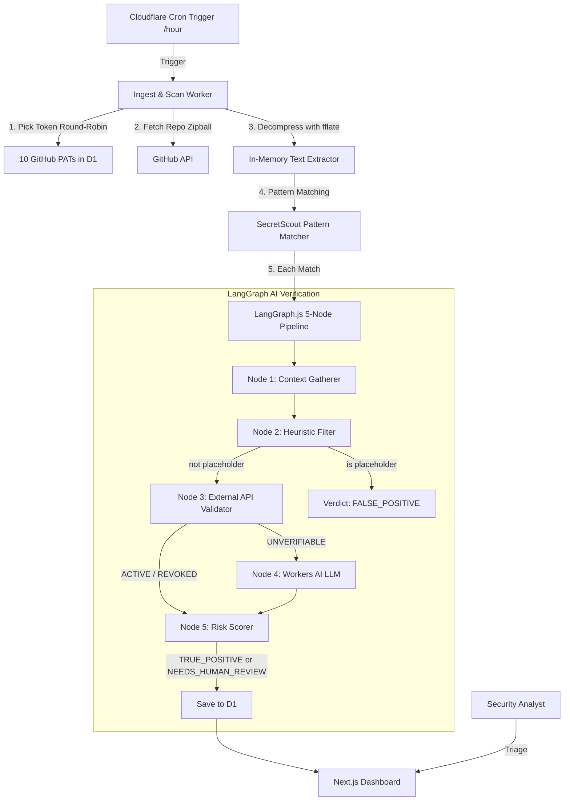

<!-- donation:eth:start -->
<div align="center">

## Support Development

If this project helps your work, support ongoing maintenance and new features.

**ETH Donation Wallet**  
`0x11282eE5726B3370c8B480e321b3B2aA13686582`

<a href="https://etherscan.io/address/0x11282eE5726B3370c8B480e321b3B2aA13686582">
  
</a>

_Scan the QR code or copy the wallet address above._

</div>
<!-- donation:eth:end -->


<div align="center">

# 🔍 RepoScout


> AI-verified GitHub secret scanning dashboard, running entirely on Cloudflare's free tier.


### _"Don't just find secrets — know which ones are still live."_

</div>

---

## Table of Contents

- [What is RepoScout?](#what-is-reposcout)
- [Use Cases](#use-cases)
- [Features](#features)
- [Architecture](#architecture)
- [Scan Execution Flow](#scan-execution-flow)
- [LangGraph AI Verification Pipeline](#langgraph-ai-verification-pipeline)
- [Risk Score Formula](#risk-score-formula)
- [Quick Start](#quick-start)
- [Project Structure](#project-structure)
- [API Reference](#api-reference)
- [CLI Tool for AI Assistants](#cli-tool-for-ai-assistants)
- [Configuration](#configuration)
- [Database Schema](#database-schema)
- [Security & Rate Limiting](#security--rate-limiting)
- [Roadmap](#roadmap)
- [Related Projects](#-related-projects)
- [Services Offered](#-services-offered)
- [License](#license)
- [Acknowledgments](#acknowledgments)

---

## What is RepoScout?

RepoScout continuously scans a list of monitored GitHub repositories for exposed secrets and credentials, then runs every match through a **5-node LangGraph.js verification pipeline** backed by **Cloudflare Workers AI** before it ever reaches a human.

Instead of dumping raw regex matches into an inbox, RepoScout resolves each finding to exactly one verdict:

| Verdict | Meaning |
|---|---|
| `TRUE_POSITIVE` | Confirmed — the credential was tested live against its provider's API and is still **ACTIVE** |
| `FALSE_POSITIVE` | Dismissed — placeholder/test value, low-entropy hash, or the credential was tested and **REVOKED** |
| `NEEDS_HUMAN_REVIEW` | Ambiguous — provider couldn't be tested (`UNVERIFIABLE`) and the LLM classifier's confidence was below 0.65 |

It reuses **[SecretScout](https://github.com/Teycir/secretscout)**'s YAML pattern templates (91 built-in, regex + literal + entropy + composite modes) and is styled with the cyberpunk/terminal-green dashboard components ported from **[ArxivExplorer](https://github.com/Teycir/ArxivExplorer)**.

Everything — cron scanning, D1 storage, AI classification, dashboard rendering — runs on Cloudflare's free tier.

---

## Use Cases

### 1. Continuous Org-Wide Monitoring
Point RepoScout at every repo in your org and let the hourly cron worker keep watch. New commits that introduce a live key get flagged within the hour — no manual scans.

```bash
npx tsx scripts/seed-repos.ts   # add repos to monitor
npm run db:seed-repos:remote
```

### 2. Cutting Through Alert Fatigue
Traditional scanners flag every `AKIA...`-shaped string whether it's a real key or a fixture in `tests/`. RepoScout's pipeline live-tests the credential against 30+ provider APIs (GitHub, AWS, Stripe, Slack, Anthropic, OpenAI, Cloudflare, and more) — `REVOKED` and placeholder matches are dismissed automatically, so the dashboard only surfaces what actually matters.

### 3. Analyst Triage Queue
Findings the pipeline can't resolve with confidence land in `/review` — a dedicated queue sorted by severity with one-click **confirm leak** / **false positive** buttons. Every triage decision is written back to D1 as `analyst_verdict`.

### 4. Repository Risk Scoring
Each monitored repo gets a numeric `risk_score` — the sum of `SeverityWeight × VerdictMultiplier` across all its findings. The dashboard's repository grid is sorted by this score, so the riskiest repos always float to the top.

### 5. Incident Response — "Did We Already Find This?"
Hit `/api/repos/<id>/findings` (or `repo-cli findings <repoId>`) to pull every finding + AI verdict + masked token + reasoning for a repo in one call — useful when a credential leak is reported and you need to confirm whether RepoScout already caught it.

### 6. AI Assistant Integration
The bundled `repo-cli` gives Claude, ChatGPT, or any agent structured read access to repos, findings, the review queue, scan history, and dashboard stats — no browser required.

```bash
repo-cli repos 10
repo-cli queue
repo-cli stats
```

---

## Features

### Scanning Engine
- **SecretScout Pattern Reuse** — 91 YAML templates compiled to JSON (`scripts/compile-patterns.ts`), covering cloud creds, VCS tokens, API keys, databases, private keys, and generic high-entropy secrets
- **Zipball Streaming** — `fflate.Unzip` decompresses repo archives in-memory, never buffering the full archive (stays within the 128 MB Worker memory limit)
- **Git Trees API Fallback** — repos > 50 MB automatically switch to recursive tree + batched blob fetches
- **Line Safety** — lines > 1,000 chars skipped to prevent catastrophic regex backtracking
- **4 Pattern Kinds** — `regex`, `literal`, `entropy` (Shannon, charset-aware thresholds), and `composite` (`requireAll` + `proximityBytes`)
- **Smart Suppression** — `secretscout:ignore`, `gitleaks:allow`, `nosec` inline markers; SSH/PEM public-key false-positive guard

### LangGraph AI Verification
- **5-Node StateGraph** — Context Gatherer → Heuristic Filter → External API Validator → Workers AI LLM Classifier → Risk Scorer
- **30+ Live Validators** — GitHub, GitLab, AWS, Stripe, Slack, Anthropic, OpenAI, HuggingFace, SendGrid, Twilio, Shopify, DigitalOcean, Mailchimp, Square, Datadog, NewRelic, npm, PyPI, DockerHub, Cloudflare, Heroku, Netlify, Vercel, Linear, Notion, Discord, Telegram, Dropbox, Twitch, Zoom, Asana, Mailgun, Sentry, Airtable, PayPal
- **RSA Proof-of-Possession** — private keys are sign+verify tested via `crypto.subtle` (no network call); a valid key → `ACTIVE`
- **Conditional Routing** — placeholder matches skip straight to scoring; confirmed `ACTIVE`/`REVOKED` skip the LLM entirely
- **KV Daily Quota Guard** — `llm_quota:{date}` caps LLM calls at 263/day (10,000 Workers AI neurons ÷ ~38/call), falling back to `NEEDS_HUMAN_REVIEW` when exhausted

### Dashboard
- **Repository Risk Grid** — cards sorted by `risk_score` desc, colour-coded by severity, `DecryptedText` reveal animation
- **Findings Inspector** (`/repo/[id]`) — code snippet with the hit line highlighted, masked token, AI reasoning, analyst override, GitHub blob link
- **Analyst Queue** (`/review`) — all `NEEDS_HUMAN_REVIEW` findings sorted by severity, mini code snippet, confidence bar, one-click triage
- **Hero Strip** — live counters for repos monitored, critical findings, analyst queue size, and a live HH:MM:SS countdown to the next hourly scan
- **Terminal-Green Aesthetic** — `JetBrains Mono`, particle background, ambient beam lines, scroll-progress scan-line — ported from ArxivExplorer

### Token Pool
- **10-PAT Rotation** — round-robin by `rate_limit_remaining`, rate-limit headers synced back to D1 after every GitHub API call
- **Theoretical 50K req/hour** — 10 × 5,000/hour free-tier GitHub PATs

### Security
- **No Raw Secrets to UI/Logs** — `rawMatchedText` never leaves the scan worker; only `maskSecret()` output (`ghp_xxxx...1234`) is persisted/displayed
- **No-Auth Rate Limiting** — KV-backed fixed-window limiter on every endpoint (write: 1/5min trigger, 30/min review; read: 60/min) — see [Security & Rate Limiting](#security--rate-limiting)

### Developer Tools
- **CLI Interface** — `repo-cli` for AI assistants (repos, findings, review queue, scan runs, stats)
- **Manual Trigger** — `POST /api/trigger` for on-demand scans during development

---

## Architecture

Built entirely on Cloudflare's edge platform:

- **Frontend**: Next.js 16 App Router, deployed as a **Cloudflare Worker** (via OpenNext `main` + `assets`)
- **Scan Worker**: Separate Cloudflare Worker (`reposcout-scan-worker`), hourly cron + manual `/api/trigger`
- **Database**: Cloudflare D1 (SQLite) — 5 tables: `repositories`, `scan_runs`, `findings`, `ai_evaluations`, `scan_tokens`
- **Cache**: Cloudflare KV — LLM quota tracking, rate limiting
- **AI**: Workers AI (`@cf/meta/llama-3.1-8b-instruct`) for `NEEDS_HUMAN_REVIEW` classification
- **Verification**: `@langchain/langgraph` 5-node `StateGraph`

### System Design



---

## Scan Execution Flow

1. **Trigger** — cron fires hourly (`0 * * * *`); manual trigger via `POST /api/trigger`
2. **Token Selection** — picks the PAT with the most remaining quota via `pickNextToken()`, falling back to sequential env order if D1 is unavailable
3. **Repo Download** — fetches the repository zipball (`GET /repos/{owner}/{repo}/zipball/HEAD`); falls back to the Git Trees API for repos > 50 MB
4. **In-Memory Decompression** — streams the zipball through `fflate.Unzip`; binary extensions and dependency dirs (`node_modules`, `.git`, `dist`, …) are skipped immediately
5. **Pattern Matching** — each text file is scanned against all SecretScout patterns (regex / literal / entropy / composite)
6. **LangGraph Pipeline** — every match enters the 5-node validation graph, exiting with exactly one verdict
7. **Persistence** — findings + AI evaluations written to D1; repository `risk_score` recalculated
8. **Dashboard** — the Next.js app reads from D1 and surfaces confirmed risks + the analyst queue in real time

---

## LangGraph AI Verification Pipeline

```typescript
export function createScanValidationGraph(env: PipelineEnv) {
  return new StateGraph(ScanFindingState)
    .addNode('gatherContext',     gatherContextNode)
    .addNode('heuristicFilter',   heuristicFilterNode)
    .addNode('apiValidation',     apiValidationNode)
    .addNode('llmClassification', llmClassificationNode)
    .addNode('riskScorer',        riskScorerNode)
    .addEdge('__start__', 'gatherContext')
    .addEdge('gatherContext', 'heuristicFilter')
    .addConditionalEdges('heuristicFilter', routeAfterHeuristic, {
      riskScorer: 'riskScorer', apiValidation: 'apiValidation',
    })
    .addConditionalEdges('apiValidation', routeAfterApiValidation, {
      riskScorer: 'riskScorer', llmClassification: 'llmClassification',
    })
    .addEdge('llmClassification', 'riskScorer')
    .addEdge('riskScorer', '__end__')
    .compile();
}
```

| Node | Purpose | Possible Outcomes |
|---|---|---|
| 1. Context Gatherer | Normalises 5-line surrounding context | — |
| 2. Heuristic Filter | Placeholder terms (`xxxx`, `dummy`, `your_key`, …) + low-entropy repeating hex | Short-circuits to `FALSE_POSITIVE` |
| 3. External API Validator | Live-tests the credential against its provider (30+ supported) | `ACTIVE` → `TRUE_POSITIVE` · `REVOKED` → `FALSE_POSITIVE` · `UNVERIFIABLE` → Node 4 |
| 4. Workers AI LLM Classifier | `@cf/meta/llama-3.1-8b-instruct`, only for `UNVERIFIABLE` findings | confidence < 0.65 → `NEEDS_HUMAN_REVIEW` |
| 5. Risk Scorer | `SeverityWeight × VerdictMultiplier` | writes `riskScore` to D1 |

---

## Risk Score Formula

$$\text{RiskScore}(R) = \sum_{f \in \text{Findings}(R)} \text{SeverityWeight}(f.\text{severity}) \times \text{VerdictMultiplier}(f.\text{verdict})$$

| Severity | Weight |
|---|---|
| critical | 100 |
| high | 40 |
| medium | 15 |
| low | 5 |
| info | 1 |

| Verdict | Multiplier |
|---|---|
| `TRUE_POSITIVE` | 2.0 |
| `NEEDS_HUMAN_REVIEW` | 1.0 |
| `FALSE_POSITIVE` | 0.0 |

---

## Quick Start

### Prerequisites

- Node.js 18+
- Cloudflare account (free tier works)
- Wrangler CLI: `npm install -g wrangler`
- 1–10 GitHub Personal Access Tokens (classic, `public_repo` scope)

### Installation

```bash
git clone https://github.com/Teycir/RepoScout.git
cd RepoScout
npm install
wrangler login

# Create infrastructure
wrangler d1 create reposcout
wrangler kv:namespace create CACHE

# Update wrangler.jsonc / wrangler.scan.toml with your IDs

# Apply database schema
npm run db:migrate:remote

# Compile SecretScout patterns (uses built-in 27-template stub if
# ../secretscout/templates/ doesn't exist)
npm run compile-patterns

# Copy and fill env files
cp .env.example .env
# Edit .env — add GITHUB_TOKEN_1..10
```

### Development

```bash
npm run dev   # Next.js dev server → http://localhost:3000
```

### Seed Tokens & Repos

```bash
npm run db:seed-tokens:remote   # hashes + masks GITHUB_TOKEN_1..10 from .env into D1
npm run db:seed-repos:remote    # edit scripts/seed-repos.ts REPOS[] first
```

### Deployment

```bash
# Deploy scan worker first (web app's service binding needs it)
npm run deploy:scan

# Deploy web app
npm run deploy

# Smoke-test
curl -X POST https://reposcout-web.<account>.workers.dev/api/trigger
```

---

## Project Structure

```
├── app/                        # Next.js 16 app directory
│   ├── page.tsx                # Dashboard — HeroStrip + RepositoryRiskGrid
│   ├── repo/[id]/page.tsx      # FindingsInspector
│   ├── review/                 # AnalystQueue
│   │   ├── page.tsx
│   │   └── TriageButtons.tsx
│   ├── api/
│   │   ├── trigger/route.ts    # POST — manual scan trigger
│   │   ├── review/route.ts     # POST — analyst triage
│   │   ├── repos/route.ts      # GET  — repository risk grid
│   │   ├── repos/[id]/findings/route.ts  # GET — findings for a repo
│   │   ├── review-queue/route.ts  # GET — NEEDS_HUMAN_REVIEW queue
│   │   ├── scan-runs/route.ts     # GET — recent scan run history
│   │   └── stats/route.ts         # GET — dashboard summary
│   └── components/
│       ├── ParticleBackground.tsx
│       ├── BackgroundBeams.tsx
│       ├── DecryptedText.tsx
│       ├── RepositoryRiskGrid.tsx
│       ├── HeroStrip.tsx
│       ├── Navbar.tsx
│       └── ScrollProgress.tsx
├── src/
│   ├── lib/                    # Shared scanning engine (port of secretscout-core)
│   │   ├── scanner.ts          # regex / literal / entropy / composite modes
│   │   ├── validator.ts        # 30+ provider live validators
│   │   ├── entropy.ts          # Shannon entropy, charset thresholds
│   │   ├── masking.ts          # ghp_xxxx...1234 masking
│   │   ├── types.ts            # Template, Match, Verdict, Env, risk helpers
│   │   └── env.ts               # GITHUB_TOKEN_* / .env loader
│   └── scan-worker/             # Cloudflare Worker — cron + manual trigger
│       ├── index.ts             # fetch + scheduled handlers, token rotation
│       ├── scanner.ts           # zipball streaming + Git Trees fallback
│       ├── pipeline.ts          # LangGraph 5-node StateGraph
│       └── patterns.json        # compiled SecretScout templates
├── cli/                          # repo-cli — AI assistant CLI
│   ├── repo-cli.ts
│   ├── package.json
│   └── README.md
├── lib/
│   ├── db.ts                    # D1 query helpers
│   └── rateLimit.ts              # KV fixed-window rate limiter
├── migrations/schema.sql         # canonical D1 schema
├── scripts/
│   ├── compile-patterns.ts       # YAML → JSON pattern compiler
│   ├── seed-tokens.ts            # hash + mask GITHUB_TOKEN_* into D1
│   └── seed-repos.ts             # seed monitored repos
├── wrangler.jsonc                 # web app config
└── wrangler.scan.toml              # scan worker config (hourly cron)
```

---

## API Reference

```
GET  /api/repos?limit=50                  # Repository risk grid (sorted by risk_score desc)
GET  /api/repos/:id/findings?limit=100    # Findings + AI evaluations for a repo
GET  /api/review-queue?limit=100          # NEEDS_HUMAN_REVIEW findings awaiting triage
GET  /api/scan-runs?limit=10              # Recent scan run history
GET  /api/stats                           # Dashboard summary counters

POST /api/trigger                         # Manual scan trigger — { repoId?, dryRun? }
POST /api/review                          # Analyst triage — { evalId, verdict }
```

All matched secrets are returned **pre-masked** (e.g. `ghp_xxxx...1234`) — `rawMatchedText` is never exposed via the API or persisted outside the scan worker's in-memory state.

---

## CLI Tool for AI Assistants

`repo-cli` gives Claude, ChatGPT, or any agent structured read access to RepoScout.

### Installation

```bash
cd cli
npm run build
chmod +x repo-cli.js
npm link
```

### Usage

```bash
repo-cli repos 20                  # List monitored repos by risk score
repo-cli findings <repoId> 50      # Findings + AI verdicts for a repo
repo-cli queue                     # Analyst review queue
repo-cli runs 5                    # Recent scan run history
repo-cli stats                     # Dashboard summary counters
```

### Output Format

```
[1] owner/repo-name
    ID: 3f9c1e2a-...
    Risk score: 140
    Critical: 1  High: 2
    Status: COMPLETED
    Last scan: 2026-06-12T10:00:00Z
    URL: https://github.com/owner/repo-name
```

### Environment Variables

```bash
export REPOSCOUT_API_BASE=https://your-deployment.workers.dev   # default: http://localhost:3000
```

See [`cli/README.md`](cli/README.md) for complete documentation.

---

## Configuration

### Environment Variables (`.env`)

```bash
# GitHub PAT rotation pool (1-10, classic, public_repo scope)
GITHUB_TOKEN_1=ghp_your_token_here
GITHUB_TOKEN_2=ghp_another_token
# ... up to GITHUB_TOKEN_10

# Optional — not yet wired to the scanner
GRAYHATWARFARE_1=...   # up to 18
URLSCAN_1=...          # up to 12
PROTONVPN_USERNAME=
PROTONVPN_PASSWORD=
```

### `wrangler.scan.toml` Secrets

Raw PATs are injected as wrangler secrets (D1 stores only SHA-256 hashes + masked display):

```bash
wrangler secret put GITHUB_TOKEN_1 --config wrangler.scan.toml
# ... repeat for GITHUB_TOKEN_2..10
```

### Cloudflare Resources

| Resource | Binding | Notes |
|---|---|---|
| D1 Database | `DB` | 5 tables — `repositories`, `scan_runs`, `findings`, `ai_evaluations`, `scan_tokens` |
| KV Namespace | `CACHE` | LLM quota (`llm_quota:{date}`) + rate limiting (`ratelimit:*`) |
| Workers AI | `AI` | `@cf/meta/llama-3.1-8b-instruct` for Node 4 classification |
| Service Binding | `SCAN_WORKER` | `reposcout-scan-worker` — used by `/api/trigger` |

---

## Database Schema

### `repositories`
Monitored repos — `risk_score`, `high_severity_findings`, `critical_severity_findings`, `last_scan_at`, `last_scan_status`

### `scan_runs`
Execution log — `total_repos_scanned`, `total_findings`, `true_positives`, `needs_human_review`, `false_positives`, `status`

### `findings`
Individual matches — `file_path`, `line_number`, `matched_text` (masked), `context` (JSON array of ±5 lines), `pattern_id`, `template_id`, `severity`

### `ai_evaluations`
LangGraph output — `verdict`, `confidence`, `validation_method` (`api_test`/`llm`/`heuristic`), `validation_status`, `reasoning`, `analyst_reviewed`, `analyst_verdict`

### `scan_tokens`
GitHub PAT pool — `token_hash` (SHA-256), `masked_token`, `rate_limit_remaining`, `rate_limit_reset`

The canonical source of truth is [`migrations/schema.sql`](migrations/schema.sql).

---

## Security & Rate Limiting

RepoScout's API has **no authentication** by design — all endpoints are protected by a KV-backed fixed-window rate limiter (`lib/rateLimit.ts`) keyed on `cf-connecting-ip`:

| Endpoint | Limit |
|---|---|
| `POST /api/trigger` | 1 / 5 min per IP |
| `POST /api/review` | 30 / min per IP |
| `GET /api/repos`, `/api/repos/:id/findings`, `/api/review-queue`, `/api/scan-runs`, `/api/stats` | 60 / min per IP |

Rate-limited requests receive `429` with `Retry-After` and `RateLimit-*` headers. If the `CACHE` binding is unavailable (e.g. local dev without `wrangler`), routes degrade to unlimited rather than failing.

`rawMatchedText` (the unmasked secret) only ever exists in the scan worker's in-memory pipeline state — it is never written to D1, never logged, and never returned by any API route. Only `maskSecret()` output (`ghp_xxxx...1234`) is persisted and displayed.

---

## Roadmap

### ✅ Phase 1 — Engine & Database
- [x] D1 schema (5 tables)
- [x] YAML → JSON pattern compiler (91 SecretScout templates)
- [x] Zipball streaming scanner (`fflate`)
- [x] Scanner — regex / literal / entropy / composite modes
- [x] 30+ provider validators + RSA proof-of-possession

### ✅ Phase 2 — LangGraph AI Pipeline
- [x] 5-node `StateGraph` with conditional routing
- [x] KV daily LLM quota guard (263 calls/day)
- [x] D1 persistence with UPSERT on `finding_id`

### ✅ Phase 3 — Dashboard
- [x] Terminal-green UI ported from ArxivExplorer
- [x] `RepositoryRiskGrid`, `FindingsInspector`, `AnalystQueue`
- [x] `/api/trigger`, `/api/review`
- [x] Read API (`/api/repos`, `/api/repos/:id/findings`, `/api/review-queue`, `/api/scan-runs`, `/api/stats`)
- [x] KV-backed rate limiting (no-auth design)
- [x] `repo-cli` for AI assistants

### 🚧 Phase 4 — Deploy & Validate
- [ ] `npm run db:migrate:remote`
- [ ] Set `GITHUB_TOKEN_1..n` wrangler secrets on scan worker
- [ ] Seed monitored repos (`scripts/seed-repos.ts`)
- [ ] `npm run deploy:scan` → `npm run deploy`
- [ ] Verify hourly cron fires; seed 1 test repo with a dummy PAT to confirm end-to-end pipeline

### 💡 Ideas & Suggestions

Have an idea? [Open an issue](https://github.com/Teycir/RepoScout/issues/new) or contribute!

---
<!-- related-projects:start -->
## 🌐 Related Projects

Explore more privacy-first and security tools:

### This Project's Origin
- **[secretscout](https://github.com/Teycir/secretscout)** - High-performance Rust CLI secret scanner. 91 YAML templates, secret validation, SARIF output, desktop app, token pool (8 PATs).

### Security Tools
- **[BurpAPISecuritySuite](https://github.com/Teycir/BurpAPISecuritySuite)** - Burp Suite extension for API security testing. 15 attack types, 108+ payloads, BOLA/IDOR detection.
- **[Mcpwn](https://github.com/Teycir/Mcpwn)** - Automated security scanner for Model Context Protocol servers. Detects RCE, path traversal, prompt injection.
- **[DiffCatcher](https://github.com/Teycir/DiffCatcher)** - Git repo discovery, diff capture, code element extraction.
- **[HoneypotScan](https://github.com/Teycir/HoneypotScan)** - Honeypot detection service for security research.
- **[CheckAPI](https://github.com/Teycir/CheckAPI)** - LLM API key validator for multiple providers. Privacy-first, client-side validation.
- **[SeekYou](https://github.com/Teycir/SeekYou)** - Host intelligence aggregator — unified OSINT across 15 sources for IPs, domains, and ASNs.

### Privacy & Encryption
- **[Timeseal](https://github.com/Teycir/Timeseal)** - Time-locked encryption vault with Dead Man's Switch. AES-256 split-key crypto, ephemeral seals.
- **[Sanctum](https://github.com/Teycir/Sanctum)** - Zero-trust encrypted vault with cryptographic plausible deniability. XChaCha20-Poly1305, Argon2id.
- **[GhostChat](https://github.com/Teycir/GhostChat)** - True P2P encrypted chat via WebRTC. No servers, no storage, self-destructing messages.

### Research & AI
- **[ArxivExplorer](https://github.com/Teycir/ArxivExplorer)** - Semantic arXiv paper search with AI-powered summaries. Source of RepoScout's dashboard components and terminal-green aesthetic.

### MCP Security Servers
- **[burp-mcp-server](https://github.com/Teycir/burp-mcp-server)** - MCP server for Burp Suite Professional. Vulnerability scanning via AI assistants.
- **[nuclei-mcp](https://github.com/Teycir/nuclei-mcp)** - MCP server for Nuclei. Multi-target scanning, severity filtering.
- **[nmap-mcp](https://github.com/Teycir/nmap-mcp)** - MCP server for Nmap. Stealth recon, vuln/NSE scanning.
<!-- related-projects:end -->

---

<!-- services:start -->
## 💼 Services Offered

- 🔒 **Security Tool Development** - Secret scanners, Burp extensions, penetration testing automation
- 🚀 **Web Application Development** - Full-stack development with Next.js, React, TypeScript
- 🔧 **Edge Computing Solutions** - Cloudflare Workers, Pages, D1, KV, Durable Objects
- 🤖 **AI Integration** - LangGraph pipelines, LLM-powered classification, intelligent automation
- 🔍 **OSINT & Threat Intelligence** - Custom reconnaissance tools, threat feed aggregation, IOC correlation
- 📊 **DevSecOps Tooling** - CI/CD secret scanning, SARIF reporting, compliance automation

**Get in Touch**: [teycirbensoltane.tn](https://teycirbensoltane.tn) | Available for freelance projects and consulting
<!-- services:end -->

---

## License

This project is licensed under the **Business Source License 1.1 (BSL 1.1)**.

- ✅ Free for personal, academic, and non-commercial use
- ❌ Commercial use requires a separate license
- 📅 Converts to **MIT License** after the change date specified in `LICENSE`

See `LICENSE` for full terms, or [contact the author](https://teycirbensoltane.tn) for commercial licensing.

---

## Acknowledgments

- [SecretScout](https://github.com/Teycir/secretscout) for the YAML pattern templates, masking utility, entropy module, and provider validator logic this project ports to TypeScript
- [ArxivExplorer](https://github.com/Teycir/ArxivExplorer) for `ParticleBackground`, `BackgroundBeams`, `DecryptedText`, the terminal-green Tailwind tokens, and the `*-cli` AI-assistant CLI pattern
- [Cloudflare](https://cloudflare.com) for D1, KV, Workers AI, and the edge platform this entire project runs on
- [LangChain](https://github.com/langchain-ai/langgraphjs) for LangGraph.js, powering the 5-node verification pipeline
- [fflate](https://github.com/101arrowz/fflate) for in-memory streaming zipball decompression

---

<!-- attribution:start -->
<div align="center">

**Built with 💚 by [Teycir Ben Soltane](https://teycirbensoltane.tn)**

</div>
<!-- attribution:end -->
