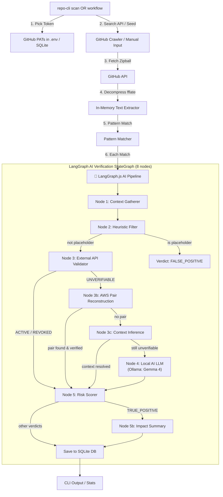

<!-- donation:eth:start -->
<div align="center">

## Support Development

If this project helps your work, support ongoing maintenance and new features.

**ETH Donation Wallet**<br>
`0x11282eE5726B3370c8B480e321b3B2aA13686582`

<a href="https://etherscan.io/address/0x11282eE5726B3370c8B480e321b3B2aA13686582">
  
</a>

_Scan the QR code or copy the wallet address above._

</div>
<!-- donation:eth:end -->

<div align="center">

# 🔍 RepoScout


> AI-verified GitHub secret scanning engine running entirely locally via SQLite and Ollama.


### _"Don't just find secrets — know which ones are still live."_

</div>

---

## Table of Contents

- [What is RepoScout?](#what-is-reposcout)
- [Use Cases](#use-cases)
- [Features](#features)
- [Architecture](#architecture)
- [Scan Execution Flow](#scan-execution-flow)
- [LangGraph AI Verification Pipeline](#langgraph-ai-verification-pipeline)
- [Risk Score Formula](#risk-score-formula)
- [Quick Start](#quick-start)
- [CLI Tool for AI Assistants](#cli-tool-for-ai-assistants)
- [Project Structure](#project-structure)
- [Configuration](#configuration)
- [Database Schema](#database-schema)
- [Security & Secret Hygiene](#security--secret-hygiene)
- [License](#license)
- [Acknowledgments](#acknowledgments)

---

## What is RepoScout?

RepoScout is an **AI-powered GitHub secret scanning platform** designed to continuously monitor repositories for exposed credentials and automatically verify their validity through an intelligent **LangGraph.js verification pipeline**. It runs entirely locally on your machine, leveraging **SQLite** for persistence and **Ollama** for AI-based context classification.

### Autonomous Crawling — No Seed List Required

RepoScout does not require you to manually provide a list of repositories to scan. An autonomous crawler discovers recently-pushed public repositories from the GitHub Search API:

- **Continuous discovery** — every run, the crawler queries `pushed:>LAST_RUN is:public` to find repos that received new commits since the previous run.
- **Change-aware** — repos already in the SQLite database are only re-queued if their `pushed_at` timestamp has advanced. Stale repos are skipped.
- **Cache-backed cursor** — the last-run timestamp is stored in a local key-value store. On the first run, it defaults to 24 hours ago.
- **Rate-limit safe** — the crawler consumes at most 5 GitHub Search API requests per run (150 repos) from the GITHUB_TOKEN pool, leaving the remaining quota for zipball scanning.
- **Deduplication** — repos are upserted by `(owner, name)` — duplicates never accumulate.

You can still manually seed repos (for orgs you own or specific targets) via the CLI. Manual repos are tagged `source='manual'`; crawler-discovered repos are tagged `source='crawler'`.

### The AI Advantage

Unlike traditional regex-based scanners that flood security teams with false positives, RepoScout uses a sophisticated **8-node LangGraph state machine** powered by a local Ollama instance (defaulting to the `gemma4:latest` model) to intelligently classify every finding:

- **Smart Context Analysis** — AI examines surrounding code (±5 lines) to understand whether a match is a real credential or test data.
- **Live Credential Testing** — Automated API validation against 30+ provider endpoints (GitHub, AWS, Stripe, Slack, Anthropic, OpenAI, and more).
- **LLM-Powered Classification** — For ambiguous cases, the Ollama model analyzes the full context and delivers confidence-scored verdicts.
- **Adaptive Routing** — LangGraph's conditional edges route findings through validation paths based on credential type, entropy, and context.

### Three-Verdict System

Instead of dumping raw regex matches into an inbox, RepoScout's AI pipeline resolves each finding to exactly one verdict:

| Verdict              | Meaning                                                                                                         |
| -------------------- | --------------------------------------------------------------------------------------------------------------- |
| `TRUE_POSITIVE`      | **AI-confirmed active credential** — tested live against the provider's API and still valid                     |
| `FALSE_POSITIVE`     | **AI-dismissed** — placeholder/test value, low-entropy, or the credential was tested and revoked                |
| `NEEDS_HUMAN_REVIEW` | **Ambiguous** — provider couldn't be tested, AWS/context-enrichment nodes found no paired data, and the LLM classifier's confidence was below 0.50 |

### Powered by LangGraph

The verification pipeline is built with **LangGraph.js**, enabling:

- **State-driven processing** with structured intermediate states.
- **Conditional routing** that adapts based on heuristic and API validation results.
- **Parallel node execution** for efficient batch processing.
- **Persistent evaluation state** stored in the local SQLite database.

---

## Use Cases

### 1. Continuous Org-Wide Monitoring
Point RepoScout at every repository in your organization. A scheduled cron or local runner script checks for pushes, discovers new edits, and alerts you when live keys are introduced.

### 2. Cutting Through Alert Fatigue
Traditional scanners flag every `AKIA...`-shaped string whether it's a real key or a dummy credential in `tests/`. RepoScout's pipeline live-tests the credential against 30+ provider APIs—`REVOKED` and placeholder matches are dismissed automatically as `FALSE_POSITIVE`, so you only review what actually matters.

### 3. Incident Response — "Did We Already Find This?"
Query the SQLite database via the `repo-cli` to pull every finding + AI verdict + masked token + reasoning for a repository in one call — useful when a leak is reported and you need to verify if it was already detected.

### 4. Repository Risk Scoring
Each monitored repository receives a numeric `risk_score` (the sum of `SeverityWeight × VerdictMultiplier` across all its findings). You can filter and sort repositories by risk score to prioritize remediation.

---

## Features

### 🤖 LangGraph AI Verification Pipeline
The heart of RepoScout — a **5-node intelligent state machine** (expanded to 8 nodes) that transforms raw pattern matches into actionable security intelligence:
- **Context-Aware Analysis** — Gathers ±5 lines of surrounding code for AI evaluation.
- **Heuristic Pre-filtering** — Instantly dismisses obvious placeholders (`xxxx`, `dummy`, `your_key`) and low-entropy patterns.
- **30+ Provider Live Testing** — Real-time API validation against GitHub, GitLab, AWS, Stripe, Slack, Anthropic, OpenAI, HuggingFace, SendGrid, Twilio, Shopify, DigitalOcean, Mailchimp, Square, Datadog, NewRelic, npm, PyPI, DockerHub, Heroku, Netlify, Vercel, Linear, Notion, Discord, Telegram, Dropbox, Twitch, Zoom, Asana, Mailgun, Sentry, Airtable, PayPal.
- **RSA Proof-of-Possession** — Private keys validated via `crypto.subtle` sign+verify (no network call needed).
- **LLM Classification** — Ollama (`gemma4:latest`) analyzes unverifiable findings with confidence scoring.
- **AWS Pair Reconstruction** — Reconstructs AWS key pairs from surrounding context and validates live via STS `GetCallerIdentity`.
- **Context Inference** — For providers that need extra parameters (Shopify shop domain, Algolia app ID, Firebase project), the LLM extracts the missing value from surrounding code and retries the API validator.
- **Impact & Blast-Radius Summary** — Every confirmed `TRUE_POSITIVE` gets an AI-generated plain-English summary: what access the credential grants, what data is reachable, and the single most important remediation step.

### Scanning Engine
- **SecretScout Pattern Reuse** — 154 compiled SecretScout templates covering cloud credentials, VCS tokens, API keys, databases, private keys, and generic high-entropy secrets.
- **Zipball Streaming** — Streams and decompresses repository archives in-memory, never buffering the full archive to disk.
- **Git Trees API Fallback** — Repositories > 50 MB automatically switch to recursive tree + batched blob fetches.
- **Line Safety** — Lines > 1,000 characters are skipped to prevent catastrophic regex backtracking.
- **4 Pattern Kinds** — `regex`, `literal`, `entropy` (Shannon, charset-aware thresholds), and `composite` (`requireAll` + `proximityBytes`).
- **Smart Suppression** — Support for `secretscout:ignore`, `gitleaks:allow`, and `nosec` inline markers.

---

## Architecture

Built as a lightweight, modular TypeScript/Node package powered by:
- **Autonomous Crawler**: Queries GitHub Search API for recent pushes, storing the cursor inside a local cache table.
- **AI Verification Core**: LangGraph.js `StateGraph` with 8 specialized nodes + local Ollama model integration.
- **Database**: SQLite (`better-sqlite3`) — containing tables for `repositories`, `scan_runs`, `findings`, `ai_evaluations`, `scan_tokens`, and `kv_store`.
- **CLI Tool**: `repo-cli` for querying, scanning, and running workflows.

### System Design



---

## Scan Execution Flow

1. **Trigger** — Execute `repo-cli scan` or `repo-cli workflow` locally.
2. **Discovery** — The crawler reads the `crawler:since` KV cursor, queries GitHub Search (`pushed:>CURSOR is:public`), and queues new repositories. Existing repos are re-queued only if their `pushed_at` has advanced.
3. **Token Selection** — Picks the GitHub Personal Access Token (PAT) with the most remaining quota via a round-robin system.
4. **Repo Download** — Fetches the repository zipball; falls back to the Git Trees API for repositories > 50 MB.
5. **Decompression** — Streams the zipball through `fflate.Unzip` in-memory. Binary extensions and dependency directories (e.g. `node_modules`, `dist`, `.git`) are skipped.
6. **Pattern Matching** — Scans text files against compiled SecretScout templates (regex / literal / entropy / composite).
7. **LangGraph Pipeline** — Runs each match through the 8-node validation graph, executing external API checks and Ollama LLM queries.
8. **Persistence** — Writes findings, AI evaluations, and scan history directly to your SQLite database.

---

## LangGraph AI Verification Pipeline

```typescript
export function createScanValidationGraph(env: PipelineEnv) {
  return new StateGraph(ScanFindingState)
    .addNode("gatherContext",      gatherContextNode)
    .addNode("heuristicFilter",    heuristicFilterNode)
    .addNode("apiValidation",      apiValidationNode)
    .addNode("awsPairReconstruct", awsPairReconstructionNode)
    .addNode("contextInference",   contextInferenceNode)
    .addNode("llmClassification",  llmClassificationNode)
    .addNode("riskScorer",         riskScorerNode)
    .addNode("impactSummary",      impactSummaryNode)
    .compile();
}
```

---

## Risk Score Formula

$$\text{RiskScore}(R) = \sum_{f \in \text{Findings}(R)} \text{SeverityWeight}(f.\text{severity}) \times \text{VerdictMultiplier}(f.\text{verdict})$$

| Severity | Weight |
| -------- | ------ |
| critical | 100    |
| high     | 40     |
| medium   | 15     |
| low      | 5      |
| info     | 1      |

| Verdict              | Multiplier |
| -------------------- | ---------- |
| `TRUE_POSITIVE`      | 2.0        |
| `NEEDS_HUMAN_REVIEW` | 1.0        |
| `FALSE_POSITIVE`     | 0.0        |

---

## Quick Start

### Prerequisites

- **Node.js**: Version 20+
- **Ollama**: Installed and running locally (`http://localhost:11434`)
- **Ollama Model**: Load the default model:
  ```bash
  ollama run gemma4:latest
  ```
- **GitHub PATs**: 1–10 classic GitHub Personal Access Tokens (needed for crawling and fetching zipballs).

### Installation & Setup

1. **Clone the repository**:
   ```bash
   git clone https://github.com/Teycir/RepoScout.git
   cd RepoScout
   ```

2. **Install dependencies**:
   ```bash
   npm install
   ```

3. **Configure environment variables**:
   Create a `.env` file at the root:
   ```bash
   cp .env.example .env
   ```
   Open `.env` and fill in your GITHUB_TOKEN values:
   ```bash
   GITHUB_TOKEN_1=ghp_your_first_token
   GITHUB_TOKEN_2=ghp_your_second_token
   # ... up to GITHUB_TOKEN_10 for round-robin rotation
   ```

4. **Compile scan patterns**:
   Compile the SecretScout patterns into optimized JSON:
   ```bash
   npm run compile-patterns
   ```

5. **Build the CLI tool**:
   ```bash
   npm run build:cli
   ```

---

## CLI Tool for AI Assistants

`repo-cli` is the command-line interface for querying local/remote statistics, running manual scans on target repositories, or triggering the crawler workflow.

### CLI Build and Link

```bash
cd cli
npm run build
npm link
```

### Usage Commands

The CLI operates in **API Mode** (pointing to a remote endpoint if configured) or **Local Mode** (`--local` or `-l` to interact directly with SQLite).

#### 1. Querying Scanned Data (Local Database)
```bash
# List repositories sorted by risk score
repo-cli repos 20 --local --db <path-to-sqlite>

# View findings and AI verdicts for a repository
repo-cli findings owner/repo 50 --local --db <path-to-sqlite>

# View findings awaiting human triage
repo-cli queue --local --db <path-to-sqlite>

# Display scan runs history
repo-cli runs 5 --local --db <path-to-sqlite>

# View overall engine statistics
repo-cli stats --local --db <path-to-sqlite>
```

#### 2. Running Local Scans & Workflows
```bash
# Scan a specific repository locally (default depth: last 5 commits)
repo-cli scan owner/repo [depth] [--db <path>] [--max-findings <n>]

# Run the complete discovery crawler + scan + pipeline workflow
# Lookback: hours to search for recent pushes (default: 24)
repo-cli workflow [lookbackHours] [--db <path>] [--max-repos <n>] [--max-findings <n>]
```

---

## Project Structure

```
├── cli/                          # repo-cli command line utility
│   ├── repo-cli.ts               # CLI logic and SQLite adapter
│   ├── tsconfig.json
│   └── README.md
├── src/
│   ├── lib/                      # Scanning engine (port of secretscout-core)
│   │   ├── scanner.ts            # Regex, literal, entropy, composite engine
│   │   ├── validator.ts          # 30+ provider API live validators
│   │   ├── entropy.ts            # Shannon entropy calculation
│   │   ├── masking.ts            # Safe masking (ghp_xxxx...1234)
│   │   ├── types.ts              # Scanning types & structures
│   │   └── env.ts                # Environment & token parser
│   └── scan-worker/
│       ├── crawler.ts            # GitHub Search API discovery crawler
│       ├── scanner.ts            # Zipball streaming and fallback logic
│       ├── pipeline.ts           # LangGraph.js 8-node evaluation pipeline
│       └── patterns.json         # Compiled JSON pattern templates
├── migrations/
│   ├── schema.sql                # SQLite core database schema
│   └── 002_crawler.sql           # SQLite crawler history schema
├── scripts/
│   └── compile-patterns.ts       # YAML to JSON template compiler
├── tests/                        # E2E test suite & SQLite database targets
│   ├── full-e2e-verification.ts  # End-to-end verification orchestrator
│   └── run-workflow.ts           # Runner script for automated workflows
├── package.json
├── tsconfig.json
└── demo-e2e-workflow.sh          # E2E execution helper script
```

---

## Database Schema

The SQLite schema consists of:
* **`repositories`**: Monitored targets with risk scoring metrics, status, source (`manual` / `crawler`), and GitHub push timestamps.
* **`scan_runs`**: Logs of scan run history, status, and outcome counters (TPs, FPs, Needs Review).
* **`findings`**: Raw findings with code context (±5 lines), matched string (masked), template IDs, and severities.
* **`ai_evaluations`**: Evaluation outputs from the LangGraph pipeline including final verdicts, confidence scores, reasoning logs, and blast-radius summaries.
* **`scan_tokens`**: Round-robin tokens with rates tracked in SQLite.
* **`kv_store`**: Key-value metadata table (used to store the crawler timestamp cursor `crawler:since`).

---

## Security & Secret Hygiene

- **No Raw Secrets Persisted**: Unmasked secret strings exist solely in the in-memory execution stack of the scan pipeline. They are never written to the SQLite database, logs, or stdout.
- **Masking**: Output strings are immediately masked using `maskSecret()` (yielding formats like `ghp_xxxx...1234`) before being saved or printed.
- **Local Sandbox**: By utilizing a local SQLite database and local Ollama model inference, no proprietary code snippets or detected secrets leave your local environment during LLM classification.

---

## License

This project is licensed under the **MIT License**. See `LICENSE` for details.

---

## Acknowledgments

- SecretScout pattern templates, masking utility, entropy module, and provider validator logic.
- [ArxivExplorer](https://github.com/Teycir/ArxivExplorer) for structural design patterns and components.
- [LangChain](https://github.com/langchain-ai/langgraphjs) for LangGraph.js, powering the state-graph routing.
- [fflate](https://github.com/101arrowz/fflate) for in-memory zipball decompression.

---

<div align="center">

**Built with 💚 by [Teycir Ben Soltane](https://teycirbensoltane.tn)**

</div>
