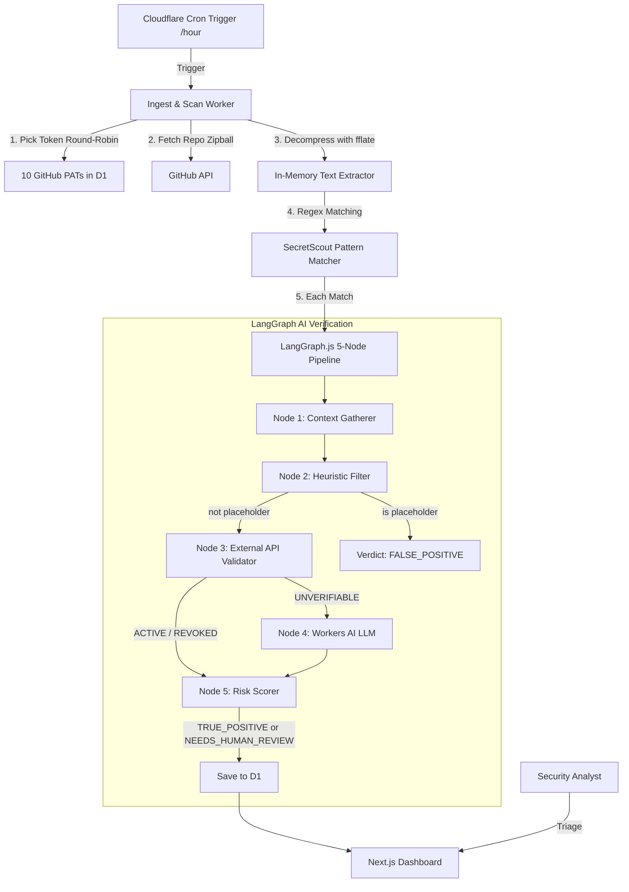

# RepoScout: Technical Specification & Architecture Design

RepoScout is a continuous repository security scanning and risk assessment platform built entirely on Cloudflare's free tier. It scans a list of monitored GitHub repositories for exposed secrets and sensitive credentials — reusing **SecretScout**'s YAML pattern templates — and runs every match through a **LangGraph.js** pipeline backed by **Cloudflare Workers AI** to issue one of two verdicts: **TRUE_POSITIVE** (confirmed risk) or **NEEDS_HUMAN_REVIEW** (ambiguous, requires analyst attention). The dashboard is styled with components and the cyberpunk/terminal-green aesthetic ported from **ArxivExplorer**.

---

## 1. System Architecture & Workflow

RepoScout runs serverless and event-driven, deployed entirely on Cloudflare free tier.



### Scan Execution Flow

1. **Trigger**: Cron fires every hour. Manual trigger available via `GET /api/trigger`.
2. **Token Selection**: Picks the most available PAT from the 10-token pool using round-robin with rate-limit awareness.
3. **Repo Download**: Fetches the repository zipball via `GET /repos/{owner}/{repo}/zipball/{ref}`. Falls back to the Git Trees API for repos over 50 MB.
4. **In-Memory Decompression**: Streams the zipball through `fflate.Unzip`. Binary and dependency paths are skipped immediately.
5. **Pattern Matching**: Each text file is scanned line-by-line against all SecretScout patterns loaded as JSON.
6. **LangGraph Pipeline**: Every match enters the 5-node validation graph. Output is exactly one of: `TRUE_POSITIVE`, `FALSE_POSITIVE`, or `NEEDS_HUMAN_REVIEW`.
7. **Persistence**: Findings and AI evaluations are written to D1. Repository risk scores are recalculated.
8. **Dashboard**: The Next.js app reads from D1, surfaces confirmed risks and items awaiting review in real time.

---

## 2. GitHub Token Pool — 10 Free-Tier PATs

The scanner relies on 10 GitHub Personal Access Tokens (classic, read-only `public_repo` scope) to distribute API load across free-tier rate limits. Each PAT gives 5,000 requests/hour, for a theoretical pool capacity of 50,000 requests/hour.

### Token Selection Strategy

At the start of each repository scan, the worker picks the PAT with the most remaining quota that is neither exhausted nor cooling down:

```sql
SELECT id, token_hash
FROM scan_tokens
WHERE is_active = 1
  AND rate_limit_remaining > 50
  AND (rate_limit_reset IS NULL OR rate_limit_reset < datetime('now'))
ORDER BY rate_limit_remaining DESC
LIMIT 1;
```

If all tokens are currently rate-limited, the scan worker computes the earliest `rate_limit_reset` and delays (or queues) until that token recovers. No scans are silently dropped.

### Rate-Limit Header Tracking

After every GitHub API response, the worker syncs the D1 token record:

```typescript
const remaining = parseInt(res.headers.get('x-ratelimit-remaining') ?? '0', 10);
const resetEpoch = parseInt(res.headers.get('x-ratelimit-reset') ?? '0', 10);
const resetISO = new Date(resetEpoch * 1000).toISOString();

await env.DB.prepare(
  `UPDATE scan_tokens
   SET rate_limit_remaining = ?, rate_limit_reset = ?
   WHERE id = ?`
).bind(remaining, resetISO, tokenId).run();
```

### D1 Token Schema

```sql
CREATE TABLE IF NOT EXISTS scan_tokens (
  id                    TEXT PRIMARY KEY,
  token_hash            TEXT NOT NULL UNIQUE,  -- SHA-256 of the raw PAT
  masked_token          TEXT NOT NULL,          -- e.g. ghp_xxxx...1234
  is_active             INTEGER DEFAULT 1,
  rate_limit_remaining  INTEGER DEFAULT 5000,
  rate_limit_reset      TEXT,                   -- ISO-8601 datetime
  last_used_at          TEXT,
  created_at            TEXT DEFAULT (datetime('now'))
);
```

---

## 3. Scanning Engine (SecretScout Reuse)

SecretScout defines all its detection rules as YAML templates under `templates/`. RepoScout converts these to a flat JSON dictionary at build time and bundles them into the scan worker.

### YAML Template Schema (SecretScout)

```yaml
id: github-token
name: GitHub Personal Access Token
description: Detects GitHub PATs and OAuth tokens
severity: critical
tags: [github, credentials, vcs]
patterns:
  - id: github-pat
    pattern: 'ghp_[0-9a-zA-Z]{36}'
    message: GitHub Personal Access Token detected
    kind: regex
  - id: github-fine-grained-pat
    pattern: 'github_pat_[a-zA-Z0-9_]{82}'
    message: GitHub Fine-grained PAT detected
    kind: regex
```

### Pattern Categories Bundled

All templates from SecretScout are included. Key categories:

| Category | Examples |
|---|---|
| `api-keys` | GitHub, OpenAI, Anthropic, Stripe, Slack, Discord, AWS, GCP, Azure, Datadog (124+ templates) |
| `cloud` | AWS access/secret keys, GCP service accounts, Azure credentials |
| `database` | Connection strings, Firebase, Supabase, PlanetScale |
| `private-keys` | PEM private keys, age secret keys |
| `tokens` | JWTs, Basic Auth |
| `passwords` | Hardcoded passwords, keyword matches |
| `generic` | High-entropy strings |

### In-Memory Streaming Decompression

The worker streams the zipball through `fflate.Unzip` rather than buffering the entire archive. This prevents OOM crashes in the 128 MB Cloudflare Workers memory limit:

```typescript
import { Unzip, UnzipInflate } from 'fflate';

const unzipper = new Unzip();
unzipper.register(UnzipInflate);
unzipper.onfile = (file) => {
  if (shouldSkipPath(file.name)) return;
  const chunks: Uint8Array[] = [];
  file.ondata = (err, data, final) => {
    if (err) return;
    chunks.push(data);
    if (final) processFileContent(file.name, chunks);
  };
  file.start();
};

// Stream zipball response body into the unzipper
const reader = zipballResponse.body!.getReader();
while (true) {
  const { done, value } = await reader.read();
  if (done) { unzipper.push(new Uint8Array(0), true); break; }
  unzipper.push(value!);
}
```

### Skipped Paths and Extensions

```typescript
const SKIP_EXTENSIONS = new Set([
  '.png', '.jpg', '.jpeg', '.gif', '.svg', '.ico',
  '.pdf', '.zip', '.tar', '.gz', '.wasm', '.woff', '.woff2', '.ttf',
  '.exe', '.dll', '.so', '.dylib', '.bin', '.lock'
]);

const SKIP_DIRS = new Set([
  'node_modules', 'bower_components', 'vendor',
  'dist', 'build', '.next', '.open-next', 'target',
  '__pycache__', '.git', '.github'
]);

function shouldSkipPath(path: string): boolean {
  const parts = path.split('/');
  if (parts.some(p => SKIP_DIRS.has(p))) return true;
  const ext = path.slice(path.lastIndexOf('.')).toLowerCase();
  return SKIP_EXTENSIONS.has(ext);
}
```

### Large Repository Fallback (> 50 MB)

```typescript
const repoMeta = await githubGet(`/repos/${owner}/${repo}`, token);
if (repoMeta.size > 50_000) { // size is in KB
  const tree = await githubGet(
    `/repos/${owner}/${repo}/git/trees/HEAD?recursive=1`, token
  );
  const textFiles = tree.tree.filter(
    (f: any) => f.type === 'blob' && f.size < 10_000_000 && !shouldSkipPath(f.path)
  );
  // Fetch files in batches of 5 with concurrency control
  for (const batch of chunk(textFiles, 5)) {
    await Promise.all(batch.map(f => fetchAndScan(f, owner, repo, token)));
  }
}
```

### Line Safety

Lines longer than 1,000 characters are skipped to prevent catastrophic regex backtracking. Each file is split on `\n` and matched line-by-line.

---

## 4. LangGraph AI Verification Pipeline

Every pattern match enters a 5-node LangGraph.js `StateGraph`. The pipeline exits with exactly one verdict:

| Verdict | Meaning |
|---|---|
| `TRUE_POSITIVE` | Confirmed live credential or exploitable finding |
| `FALSE_POSITIVE` | Placeholder, test data, or revoked key — dismissed |
| `NEEDS_HUMAN_REVIEW` | Ambiguous; LLM confidence below threshold or API inconclusive |

`NEEDS_HUMAN_REVIEW` replaces the old `SUSPICIOUS` label and is surfaced prominently in the dashboard as an analyst queue.

### LangGraph State

```typescript
import { StateGraph, Annotation } from "@langchain/langgraph";

export const ScanFindingState = Annotation.Root({
  findingId:             Annotation<string>(),
  repoName:              Annotation<string>(),
  filePath:              Annotation<string>(),
  lineNumber:            Annotation<number>(),
  matchedText:           Annotation<string>(),
  lineContent:           Annotation<string>(),
  surroundingContext:    Annotation<string>(),   // 5 lines above + 5 below
  patternId:             Annotation<string>(),
  templateId:            Annotation<string>(),
  severity:              Annotation<'info' | 'low' | 'medium' | 'high' | 'critical'>(),
  isHeuristicPlaceholder: Annotation<boolean>(),
  validationStatus:      Annotation<'ACTIVE' | 'REVOKED' | 'UNVERIFIABLE' | 'FALSE_POSITIVE'>(),
  verdict:               Annotation<'TRUE_POSITIVE' | 'FALSE_POSITIVE' | 'NEEDS_HUMAN_REVIEW'>(),
  aiReasoning:           Annotation<string>(),
  confidenceScore:       Annotation<number>(),   // 0.0 – 1.0
  validationMethod:      Annotation<'api_test' | 'llm' | 'heuristic'>(),
});
```

### Node 1 — Context Gatherer

Normalises the matched text (trims whitespace, enforces max 200-char truncation for the LLM prompt) and annotates the file extension and variable name from the surrounding lines.

### Node 2 — Heuristic Filter

Screens for obvious placeholders before spending API quota or Workers AI neurons:

```typescript
const PLACEHOLDER_TERMS = [
  'placeholder', 'example', 'your_key', 'your_token', 'my_key',
  'xxxx', 'test_key', 'dummy', 'sample', 'replace_me', 'insert_key'
];

function isPlaceholder(text: string): boolean {
  const lower = text.toLowerCase();
  if (PLACEHOLDER_TERMS.some(t => lower.includes(t))) return true;
  // Low-entropy hex strings (repeating nibbles)
  if (/^[a-f0-9]{32,}$/i.test(text) && new Set(lower).size <= 5) return true;
  return false;
}
```

If placeholder: set `verdict = FALSE_POSITIVE`, skip remaining nodes.

### Node 3 — External API Validator

Performs a read-only live credential check for known token types. Results in `ACTIVE` or `REVOKED`; unknown types return `UNVERIFIABLE` and route to Node 4.

| Secret Type | Endpoint | ACTIVE Signal | REVOKED Signal |
|---|---|---|---|
| GitHub PAT | `GET /user` with `Authorization: Bearer` | HTTP 200 | HTTP 401 |
| GitHub Fine-Grained PAT | Same | HTTP 200 | HTTP 401 |
| Slack Webhook | POST `{}` to webhook URL | HTTP 400 `invalid_payload` | HTTP 403 or 404 |
| Stripe Secret Key | `GET /v1/charges` Basic Auth | HTTP 200 or 400 | HTTP 401 |
| AWS (Access + Secret) | STS `GetCallerIdentity` with SigV4 | HTTP 200 | HTTP 403 |
| Generic / Unrecognised | — | — | → UNVERIFIABLE → Node 4 |

```typescript
// Example: GitHub PAT check
async function validateGitHubToken(token: string): Promise<ValidationResult> {
  const res = await fetch('https://api.github.com/user', {
    headers: {
      'Authorization': `Bearer ${token}`,
      'User-Agent': 'RepoScout-Validator/1.0',
    },
  });
  if (res.status === 200) return { status: 'ACTIVE',   verdict: 'TRUE_POSITIVE' };
  if (res.status === 401) return { status: 'REVOKED',  verdict: 'FALSE_POSITIVE' };
  return              { status: 'UNVERIFIABLE',        verdict: 'NEEDS_HUMAN_REVIEW' };
}
```

If `ACTIVE` → `TRUE_POSITIVE`. If `REVOKED` → `FALSE_POSITIVE`. Both skip Node 4.
If `UNVERIFIABLE` → proceed to Node 4 (LLM).

### Node 4 — Cloudflare Workers AI LLM Classifier

Only invoked for `UNVERIFIABLE` findings. Uses `@cf/meta/llama-3.1-8b-instruct` via the `env.AI` binding.

```typescript
const prompt = `
You are a senior application security engineer. Analyze the following code finding.

REPOSITORY: ${state.repoName}
FILE: ${state.filePath} (line ${state.lineNumber})
RULE: ${state.patternId}
MATCHED VALUE: ${state.matchedText}

SURROUNDING CODE:
\`\`\`
${state.surroundingContext}
\`\`\`

Determine if this is a TRUE_POSITIVE (real exposed secret) or NEEDS_HUMAN_REVIEW (ambiguous, possibly real, needs analyst).
Only respond FALSE_POSITIVE if you are highly confident it is a test value or placeholder.

Respond ONLY in this exact JSON format, no markdown:
{
  "verdict": "TRUE_POSITIVE" | "FALSE_POSITIVE" | "NEEDS_HUMAN_REVIEW",
  "reasoning": "brief explanation under 100 words",
  "confidence": 0.0
}
`.trim();

const response = await env.AI.run('@cf/meta/llama-3.1-8b-instruct', {
  messages: [
    { role: 'system', content: 'You are a JSON-only response assistant. Never use markdown.' },
    { role: 'user',   content: prompt },
  ],
});

const raw = (response.response ?? response.text ?? '').trim();
const result = JSON.parse(raw); // strip-json-comments safe

// If confidence < 0.65, escalate to NEEDS_HUMAN_REVIEW regardless
if (result.confidence < 0.65) {
  result.verdict = 'NEEDS_HUMAN_REVIEW';
  result.reasoning += ' (confidence below threshold)';
}
```

### Node 5 — Risk Scorer

Computes the final numeric risk contribution of this finding to its repository:

```typescript
const SEVERITY_WEIGHT: Record<string, number> = {
  critical: 100, high: 40, medium: 15, low: 5, info: 1,
};

const VERDICT_MULTIPLIER: Record<string, number> = {
  TRUE_POSITIVE:     2.0,   // Confirmed live
  NEEDS_HUMAN_REVIEW: 1.0,  // Possibly real
  FALSE_POSITIVE:    0.0,   // Dismissed
};

const score =
  SEVERITY_WEIGHT[state.severity] *
  VERDICT_MULTIPLIER[state.verdict];
```

The repository's `risk_score` in D1 is the sum of all finding scores from the last scan run.

### Graph Wiring

```typescript
export function createScanValidationGraph(env: Env) {
  return new StateGraph(ScanFindingState)
    .addNode('gatherContext',   (s) => gatherContextNode(s))
    .addNode('heuristicFilter', (s) => heuristicFilterNode(s))
    .addNode('apiValidation',   (s) => apiValidationNode(s, env))
    .addNode('llmClassify',     (s) => llmClassifyNode(s, env))
    .addNode('riskScorer',      (s) => riskScorerNode(s))
    .addEdge('__start__',       'gatherContext')
    .addEdge('gatherContext',   'heuristicFilter')
    .addConditionalEdges('heuristicFilter', (s) =>
      s.isHeuristicPlaceholder ? 'riskScorer' : 'apiValidation'
    )
    .addConditionalEdges('apiValidation', (s) =>
      s.validationStatus === 'UNVERIFIABLE' ? 'llmClassify' : 'riskScorer'
    )
    .addEdge('llmClassify',     'riskScorer')
    .addEdge('riskScorer',      '__end__')
    .compile();
}
```

---

## 5. Workers AI Free-Tier Budget

Workers AI free tier provides **10,000 neurons/day** (resets 00:00 UTC). LLM calls are expensive; only `UNVERIFIABLE` findings reach Node 4.

| Operation | Estimated Neurons |
|---|---|
| LLM classification (Node 4) | ~38 neurons |
| Daily LLM budget | ~263 findings/day |
| API-validated findings (Nodes 1–3, 5) | 0 neurons |

To stay within budget, the scan worker checks a daily KV quota counter before invoking Workers AI — identical to the strategy in `ArxivExplorer/src/ingest-worker/pipeline.ts`:

```typescript
const LLM_NEURONS_PER_CALL = 38;
const MAX_LLM_CALLS_PER_DAY = Math.floor(10_000 / LLM_NEURONS_PER_CALL); // 263

const todayKey = new Date().toISOString().slice(0, 10);
const used = parseInt(await env.CACHE.get(`llm_quota:${todayKey}`) ?? '0', 10);

if (used >= MAX_LLM_CALLS_PER_DAY) {
  // Quota exhausted: skip LLM, return NEEDS_HUMAN_REVIEW directly
  return { verdict: 'NEEDS_HUMAN_REVIEW', aiReasoning: 'LLM quota exhausted', confidenceScore: 0 };
}
```

---

## 6. D1 Database Schema

```sql
-- Monitored repositories
CREATE TABLE IF NOT EXISTS repositories (
  id                          TEXT PRIMARY KEY,
  owner                       TEXT NOT NULL,
  name                        TEXT NOT NULL,
  url                         TEXT NOT NULL,
  risk_score                  REAL    DEFAULT 0.0,
  high_severity_findings      INTEGER DEFAULT 0,
  critical_severity_findings  INTEGER DEFAULT 0,
  last_scan_at                TEXT,
  last_scan_status            TEXT    DEFAULT 'PENDING',
  created_at                  TEXT    DEFAULT (datetime('now')),
  updated_at                  TEXT    DEFAULT (datetime('now'))
);

-- Scan execution log
CREATE TABLE IF NOT EXISTS scan_runs (
  id                    TEXT PRIMARY KEY,
  started_at            TEXT NOT NULL,
  completed_at          TEXT,
  total_repos_scanned   INTEGER DEFAULT 0,
  total_findings        INTEGER DEFAULT 0,
  true_positives        INTEGER DEFAULT 0,
  needs_human_review    INTEGER DEFAULT 0,
  false_positives       INTEGER DEFAULT 0,
  status                TEXT NOT NULL  -- 'RUNNING' | 'COMPLETED' | 'FAILED'
);

-- Individual secret findings
CREATE TABLE IF NOT EXISTS findings (
  id            TEXT PRIMARY KEY,
  scan_run_id   TEXT NOT NULL,
  repo_id       TEXT NOT NULL,
  file_path     TEXT NOT NULL,
  file_url      TEXT NOT NULL,
  line_number   INTEGER NOT NULL,
  matched_text  TEXT NOT NULL,   -- Masked: ghp_xxxx...xxxx
  line_content  TEXT NOT NULL,
  context       TEXT NOT NULL,   -- 5 lines above/below as JSON array
  pattern_id    TEXT NOT NULL,
  template_id   TEXT NOT NULL,
  severity      TEXT NOT NULL,
  detected_at   TEXT DEFAULT (datetime('now')),
  FOREIGN KEY(scan_run_id) REFERENCES scan_runs(id) ON DELETE CASCADE,
  FOREIGN KEY(repo_id)     REFERENCES repositories(id) ON DELETE CASCADE
);

-- AI evaluation results
CREATE TABLE IF NOT EXISTS ai_evaluations (
  id                TEXT PRIMARY KEY,
  finding_id        TEXT NOT NULL UNIQUE,
  verdict           TEXT NOT NULL,   -- 'TRUE_POSITIVE' | 'FALSE_POSITIVE' | 'NEEDS_HUMAN_REVIEW'
  confidence        REAL NOT NULL,
  validation_method TEXT NOT NULL,   -- 'api_test' | 'llm' | 'heuristic'
  validation_status TEXT NOT NULL,   -- 'ACTIVE' | 'REVOKED' | 'UNVERIFIABLE' | 'FALSE_POSITIVE'
  reasoning         TEXT NOT NULL,
  external_response TEXT,            -- Masked API response snippet
  evaluated_at      TEXT DEFAULT (datetime('now')),
  analyst_reviewed  INTEGER DEFAULT 0,   -- 1 once a human has triaged it
  analyst_verdict   TEXT,               -- Human override if different from AI
  FOREIGN KEY(finding_id) REFERENCES findings(id) ON DELETE CASCADE
);

-- GitHub PAT rotation pool (10 tokens)
CREATE TABLE IF NOT EXISTS scan_tokens (
  id                   TEXT PRIMARY KEY,
  token_hash           TEXT NOT NULL UNIQUE,
  masked_token         TEXT NOT NULL,
  is_active            INTEGER DEFAULT 1,
  rate_limit_remaining INTEGER DEFAULT 5000,
  rate_limit_reset     TEXT,
  last_used_at         TEXT,
  created_at           TEXT DEFAULT (datetime('now'))
);

-- INDEXES
CREATE INDEX IF NOT EXISTS idx_findings_repo      ON findings(repo_id);
CREATE INDEX IF NOT EXISTS idx_findings_severity  ON findings(severity);
CREATE INDEX IF NOT EXISTS idx_evaluations_verdict ON ai_evaluations(verdict);
```

---

## 7. Next.js Frontend & ArxivExplorer Component Reuse

The dashboard is built with Next.js App Router, styled to match the cyberpunk/terminal-green aesthetic of ArxivExplorer.

### Components Ported from ArxivExplorer

| Component | Origin | Use in RepoScout |
|---|---|---|
| `ParticleBackground.tsx` | `ArxivExplorer/app/` | Matrix-style floating nodes behind dashboard |
| `BackgroundBeams.tsx` | `ArxivExplorer/app/` | Ambient glowing beams behind repo cards |
| `DecryptedText.tsx` | `ArxivExplorer/app/` | Animates repo names and risk scores on load |
| Font config (JetBrains Mono + Inter) | `ArxivExplorer/app/layout.tsx` | Monospace terminal feel throughout |
| `tailwind.config.ts` tokens | `ArxivExplorer/` | `terminal-green`, neon glow, pulse animations |

### Dashboard Views

**Hero Strip**: Live counters — total repos monitored, active critical findings, items in analyst queue, next scan in HH:MM:SS.

**Repository Risk Grid**: Cards sorted by `risk_score` descending. Each card shows:
- Repository name (DecryptedText animation on load)
- Risk score meter (colour-coded: red > 500, amber > 100, green ≤ 100)
- Count badges: `🔴 TRUE_POSITIVE` / `🟡 NEEDS_HUMAN_REVIEW`
- Last scan timestamp

**Findings Inspector**: Clicking a repo opens an expanded panel. Each finding shows:
- File path + line number (links to GitHub blob URL)
- Masked matched value (e.g. `ghp_xxxx...1234`)
- Surrounding code snippet with the match line highlighted
- AI verdict badge + reasoning text
- For `NEEDS_HUMAN_REVIEW`: **Mark as Confirmed** / **Dismiss as FP** analyst action buttons

**Analyst Queue**: Dedicated `/review` page listing all `NEEDS_HUMAN_REVIEW` findings across all repos, sorted by severity. One-click triage. Completed items update `analyst_reviewed = 1` in D1.

### Risk Score Formula

$$\text{RiskScore}(R) = \sum_{f \in \text{Findings}(R)} \text{SeverityWeight}(f.\text{severity}) \times \text{VerdictMultiplier}(f.\text{verdict})$$

| Severity | Weight | Verdict | Multiplier |
|---|---|---|---|
| critical | 100 | TRUE_POSITIVE | 2.0 |
| high | 40 | NEEDS_HUMAN_REVIEW | 1.0 |
| medium | 15 | FALSE_POSITIVE | 0.0 |
| low | 5 | | |
| info | 1 | | |

---

## 8. Cloudflare Configuration

### `wrangler.jsonc` — Next.js Web App

```jsonc
{
  "$schema": "node_modules/wrangler/config-schema.json",
  "name": "reposcout-web",
  "main": ".open-next/worker.js",
  "compatibility_date": "2025-05-01",
  "compatibility_flags": ["nodejs_compat"],
  "assets": { "directory": ".open-next/assets", "binding": "ASSETS" },
  "d1_databases": [
    { "binding": "DB", "database_name": "reposcout", "database_id": "YOUR_D1_ID" }
  ],
  "kv_namespaces": [
    { "binding": "CACHE", "id": "YOUR_KV_ID" }
  ],
  "ai": { "binding": "AI" },
  "vars": {
    "SUMMARY_MODEL": "@cf/meta/llama-3.1-8b-instruct"
  }
}
```

### `wrangler.scan.toml` — Cron Scan Worker

```toml
name = "reposcout-scan-worker"
main = "src/scan-worker/index.ts"
compatibility_date = "2025-05-01"
workers_dev = true

[triggers]
crons = ["0 * * * *"]  # Hourly

[[d1_databases]]
binding = "DB"
database_name = "reposcout"
database_id = "YOUR_D1_ID"

[[kv_namespaces]]
binding = "CACHE"
id = "YOUR_KV_ID"

[ai]
binding = "AI"
```

---

## 9. Implementation Roadmap

### Phase 1 — Engine & Database (Week 1)

- Run D1 migration: `wrangler d1 execute reposcout --file=migrations/schema.sql`
- Seed `scan_tokens` with the 10 GitHub PATs (hashed + masked)
- Build the YAML→JSON pattern compiler (`scripts/compile-patterns.ts`): walks `secretscout/templates/**/*.yaml`, emits `src/scan-worker/patterns.json`
- Implement zipball streaming scanner in `src/scan-worker/scanner.ts` using `fflate`
- Unit-test the scanner against synthetic fixture files

### Phase 2 — LangGraph Pipeline (Week 2)

- Complete `src/scan-worker/pipeline.ts` based on the `StateGraph` blueprint already in place
- Implement `ExternalApiValidator` for GitHub, Slack, Stripe, AWS
- Tune the Llama-3.1 prompt to reliably emit valid JSON (test ≥50 samples)
- Add KV quota guard mirroring ArxivExplorer's `NEURONS_PER_PAPER` pattern
- Wire `createScanValidationGraph` into the main worker `fetch` + `scheduled` handlers

### Phase 3 — Dashboard (Week 3)

- Bootstrap Next.js App Router under `/` (already scaffolded in `package.json`)
- Copy `ParticleBackground`, `BackgroundBeams`, `DecryptedText` from ArxivExplorer
- Port `tailwind.config.ts` colour tokens (terminal-green, neon glow, pulse animations)
- Build `RepositoryRiskGrid`, `FindingsInspector`, and `AnalystQueue` pages
- Add `/api/trigger` route for manual scan execution during development

### Phase 4 — Deploy & Validate (Week 4)

- Deploy scan worker: `wrangler deploy --config wrangler.scan.toml`
- Deploy web app: `npm run deploy`
- Trigger test scan against 3 known repos (one with a dummy exposed PAT in a test branch)
- Verify end-to-end: pattern match → LangGraph → D1 → dashboard verdict display
- Load test token pool with simulated rate-limit exhaustion; verify fallback behaviour
